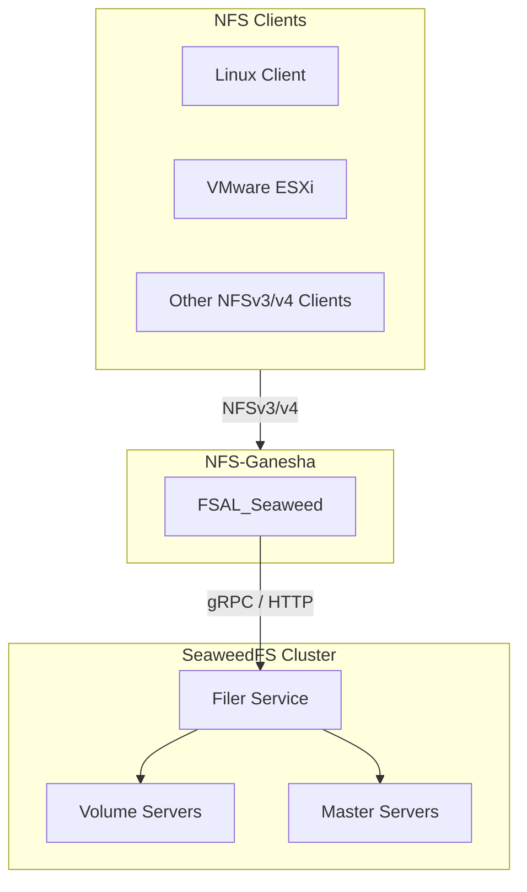
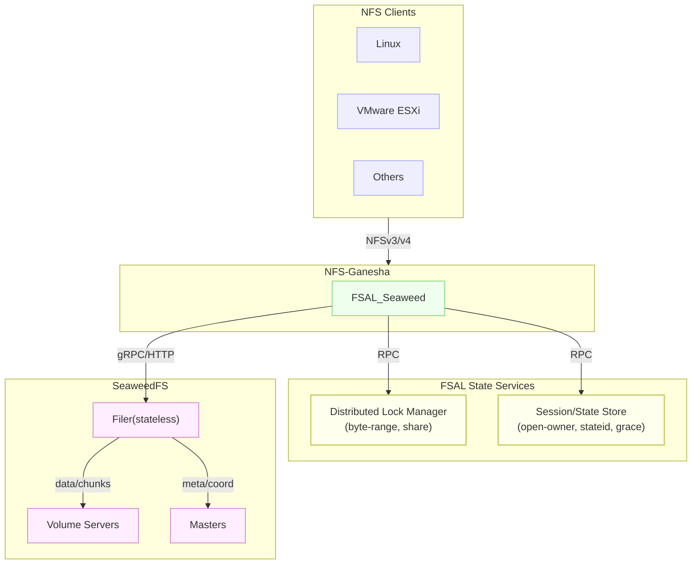
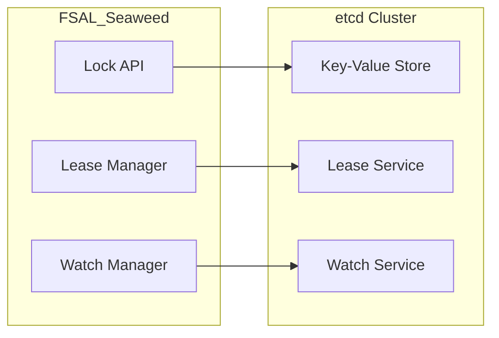
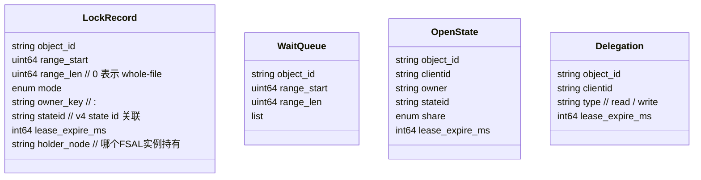
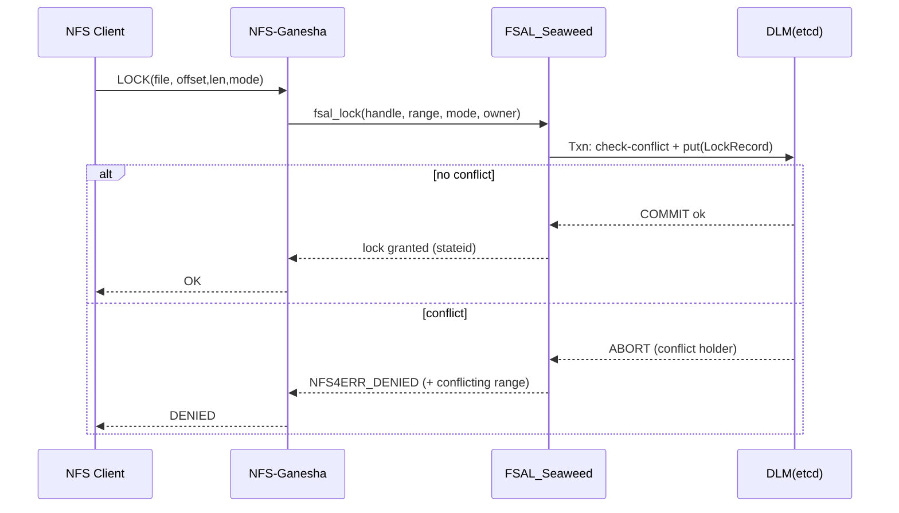
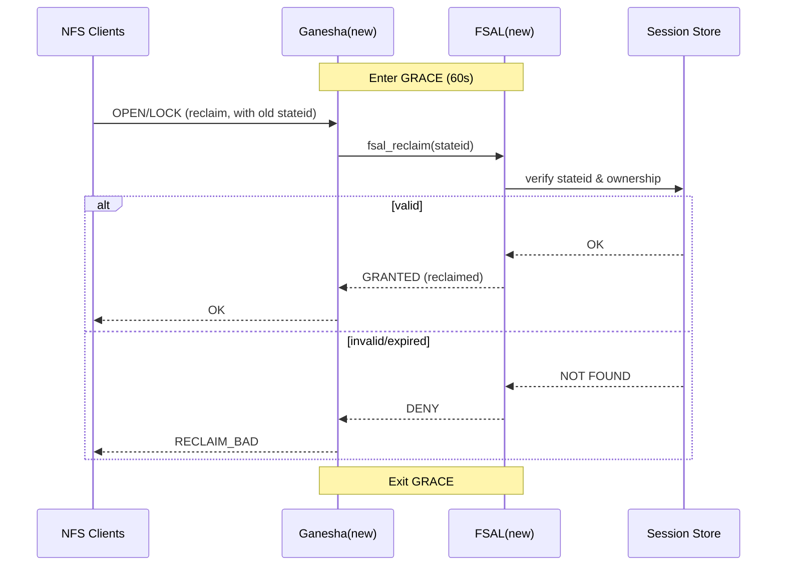

# FSAL_Seaweed for NFS-Ganesha设计文档

## 1. 背景与目标

- **需求**：为现有应用和客户端（Linux、VMware、NAS 设备等）提供标准 **NFSv3/v4 接口**，支持文件共享、锁语义、多客户端协作。
- **存储后端**：SeaweedFS Filer 作为命名空间和元数据管理，Volume servers 提供实际存储。
- **目标**：通过在 NFS-Ganesha 中实现一个新的 FSAL（File System Abstraction Layer），直接对接 Filer 的 API，绕过 FUSE 层，提升性能并保证一致性。

------

## 2. 总体架构



------

## 3. FSAL_Seaweed 模块设计

### 3.1 Handle / Inode 管理

- **需求**：NFS filehandle 必须可解码、可持久、可恢复。
- **方案**：
  - 基于文件完整路径生成 filehandle：`filehandle = hash(full_path) + metadata`
  - filehandle 结构：
    ```c
    struct seaweed_filehandle {
        uint32_t magic;           // FSAL 魔数标识
        uint16_t version;         // 版本号，支持格式演进
        uint16_t flags;           // 标志位（保留）
        char path_hash[16];       // 完整路径的 MD5 哈希
        uint64_t create_time;     // 文件创建时间戳
        uint64_t generation;      // 版本生成号
    } __attribute__((packed));
    ```
  - **映射表维护**：FSAL 层维护内存映射表 `path_hash → full_path`，支持反向解析
  - **持久化选项**：映射表可选择性持久化到本地文件或 etcd，支持重启恢复

**优势**：
- 基于路径的 filehandle 保证唯一性和稳定性
- 支持文件移动后的路径更新（通过 rename 操作更新映射表）
- 创建时间和 generation 提供额外的一致性校验

------

### 3.2 基本操作映射

| FSAL 接口       | Filer API 假设                 | 说明                      |
| --------------- | ------------------------------ | ------------------------- |
| lookup          | `GetEntry(path)`               | 返回 object_id + metadata |
| create          | `CreateEntry(path)`            | 支持文件、目录            |
| remove          | `DeleteEntry(path)`            | 文件/目录删除             |
| rename          | `RenameEntry(src,dst)`         | 需跨目录原子              |
| getattr/setattr | `GetEntry/UpdateEntry`         | 支持 mode/uid/gid/mtime   |
| read/write      | `ReadChunk/WriteChunk`         | offset I/O                |
| readdir         | `ListEntries(dir,limit,token)` | 分页遍历                  |
| fsync           | `CommitEntry(object_id)`       | flush 保证持久化          |

⚠️ **假设-2**：Filer 提供 **offset-based I/O API**，否则需要额外分块逻辑。

------

### 3.3 锁与一致性

- **NFSv4 锁**：byte-range lock, open-owner, delegation。
- **方案**：
  - 优先使用 Filer 内建锁 API；
  - 若缺失，需借助 etcd/redis 等外部分布式锁服务。
- **一致性**：
  - 读取时校验版本号（etag/mtime）；
  - 写入后更新版本；
  - Ganesha 属性缓存 TTL 可调。

⚠️ **假设-3**：Filer 提供 **原子锁接口**（文件/字节范围级别），并能在会话断开时自动清理。

------

### 3.4 权限与安全

- **NFS AUTH_SYS**：FSAL 将 uid/gid 与 Filer 元数据对比。
- **Filer 元数据**：需存储 `uid/gid/mode/acl`。
- **扩展**：支持 Kerberos（krb5），由 Ganesha 完成认证，FSAL 只做权限判断。

⚠️ **假设-4**：Filer 支持存储 **POSIX-like 元数据**。

------

### 3.5 目录与大目录处理

- 使用 `ListEntries` 分页；
- FSAL 负责将 **pagination token ↔ NFS cookie** 转换，保证客户端能无缝恢复。

⚠️ **假设-5**：Filer 提供 **稳定的分页遍历接口**，目录更新不会导致 token 乱序。

------

### 3.6 HA 与恢复

- Ganesha 层：CTDB 提供 VIP 和 state 恢复；
- FSAL 层：需在 grace period 内允许客户端 reclaim 锁；
- 与 Filer 交互时需确认旧锁有效性。

⚠️ **假设-6**：Filer 保证 **锁/会话可恢复** 或能检测并清理。

------

## 4. 性能与缓存设计

- **读缓存**：利用 Ganesha `cache_inode` + etag 校验；
- **写策略**：支持 sync/async 两种，async 允许批量 flush；
- **大文件优化**：分块并行 I/O；
- **目录缓存**：TTL 默认 1–5s，可调。

------

## 5. 关键假设 Checklist

1. Filer 提供 **稳定唯一 object_id/etag**。
2. Filer 支持 **offset-based I/O**。
3. Filer 提供 **原子锁 API**，并能处理会话失效。
4. Filer 支持 **POSIX-like 元数据**（uid/gid/mode/acl）。
5. Filer 提供 **稳定分页遍历接口**。
6. Filer 保证 **锁/会话恢复** 或清理。

1，2，4，5都满足。3和6见后面的文档。

## 锁与会话管理设计

> 结论先行：由于 **SeaweedFS Filer 无状态**、当前仅具备**文件级锁**（无 byte-range 锁）且**锁/会话为内存态**，因此：
>
> - **NFSv3** 可通过在 **FSAL 层自管文件级锁**（可选接入分布式 KV）快速落地；
> - **NFSv4** 需在 **FSAL 层构建“分布式锁与会话管理”能力**（etcd/Consul/ZK），以满足 byte-range 锁、state 恢复、grace 期 reclaim 等完整语义。

------

## 1. 背景与约束

- 上层目标：向客户端提供 **NFSv3/v4** 协议，支持共享访问、并发写、锁语义与故障恢复。
- 下层后端：**SeaweedFS Filer**（无状态路由与元数据服务）+ Volume Servers（数据块）+ Master。
- 已知约束：
  1. **Filer 无状态**，锁/会话保存在**单机内存**；
  2. 具备**文件级锁**，**无 byte-range 锁**；
  3. **Failover 无法恢复会话与锁**（无持久化/分布式一致性）。

------

## 2. 设计目标

- **功能目标**：
  - NFSv3：支持基本读写、目录操作、整文件锁（NLM）。
  - NFSv4：支持 open/close/stateid、share reservations、**byte-range locks**、delegation（可阶段性关闭）、**grace期内的锁与state恢复**。
- **非功能目标**：
  - 一致性：满足 NFS 语义，避免脏读/写丢；
  - 可用性：Ganesha HA（CTDB）场景下状态可恢复；
  - 性能：少拦截、不重复写放大；
  - 可观测性：锁冲突、等待队列、state 重放、reclaim 率等指标。

------

## 3. 总体架构



> 注：
>
> - **Path A (NFSv3)** 可将 LM/SM 收敛为“文件级锁表”（内存或单独 etcd）——轻量版；
> - **Path B (NFSv4)** 需要完整的 **LM+SM 分布式与持久化**。

------

## 4. 两条实现路径

### 4.1 Path A：NFSv3（简化版）

**思路**：

- 在 FSAL 内实现 **文件级锁表** 与 **NLM 映射**；
- 锁表可先放内存，HA 时接入 **etcd** 做持久化/抢占仲裁；
- 不提供 byte-range 锁；
- 不处理 v4 stateid/委托；
- 适合备份/共享读写/一般办公场景。

**组件**：

- `FileLockTable`（可选 etcd backend）：(object_id) → {owner, mode, lease, waiters}
- `Reclaimer`：Ganesha 重启/CTDB 切换后，加载锁表；
- `LeaseManager`：定期续租/超时清理。

**优缺点**：

- ✅ 快速可用，改造最小；
- ❌ 不满足 byte-range 与 v4 的 state 恢复细节，数据库/VM 等场景不适用。

------

### 4.2 Path B：NFSv4（完整语义）

**思路**：

- 独立实现 **分布式锁与会话服务**：
  - **Distributed Lock Manager (DLM)**：文件级+**byte-range** 锁、share reservation；
  - **Session/State Store (SSS)**：open-owner、stateid、delegation、grace 信息的**持久化**；
- 以 **etcd/Consul/ZK** 为一致性底座，Ganesha/FSAL 可横向扩展、故障自恢复；
- Filer 仍保持无状态，只负责数据/元数据读写。

**关键要求**：

- **强一致**（线性化）锁/状态写入；
- **重新选主**与 **租约（lease）续期**；
- **grace period** 内的 **reclaim** 流程。

------

## 5. 锁与会话详细设计（Path B）

## 5. etcd 分布式锁接口设计

### 5.1 接口架构

etcd 作为分布式锁后端，基于其 **KV + Lease + Watch** 能力实现完整的锁管理：



### 5.2 锁键值设计

```bash
# 锁记录键格式
/nfs-locks/<fsal_instance>/<path_hash>/<lock_type>/<range_id>

# 等待队列键格式  
/nfs-waits/<fsal_instance>/<path_hash>/<sequence_id>

# 会话状态键格式
/nfs-sessions/<client_id>/<session_id>/<stateid>
```

**锁记录值结构**：
```json
{
  "owner": "<client_id>:<owner_id>",
  "lock_type": "read|write|share_read|share_write",
  "range": {"start": 0, "length": 0},  // 0 表示whole-file
  "stateid": "xxxx-xxxx-xxxx",
  "timestamp": 1640995200,
  "lease_id": "etcd_lease_id",
  "holder_node": "ganesha-node-1"
}
```

### 5.3 核心接口实现

#### 获取锁流程
```c
fsal_status_t seaweed_acquire_lock(
    const seaweed_handle_t *handle,
    const lock_range_t *range, 
    lock_type_t type,
    const char *owner,
    char *stateid_out
) {
    // 1. 冲突检测事务
    etcd_txn_t txn = etcd_txn_create();
    
    // 检查冲突：相同range内是否已有不兼容锁
    char conflict_key[256];
    snprintf(conflict_key, sizeof(conflict_key), 
             "/nfs-locks/%s/%s/%s/*", 
             fsal_instance, handle->path_hash, range_to_string(range));
    
    etcd_txn_if_not_exists(txn, conflict_key);
    
    // 创建锁记录
    char lock_key[256];
    char lock_value[1024];
    
    create_lock_record(lock_key, lock_value, handle, range, type, owner);
    etcd_txn_then_put(txn, lock_key, lock_value, lease_id);
    
    // 2. 原子提交
    etcd_result_t result = etcd_txn_commit(txn);
    
    if (result.success) {
        generate_stateid(stateid_out);
        return FSAL_NO_ERROR;
    } else {
        return FSAL_LOCK_BLOCKED; // 冲突，需要等待或返回错误
    }
}
```

#### 释放锁流程
```c
fsal_status_t seaweed_release_lock(
    const char *stateid,
    bool revoke_lease
) {
    char lock_key[256];
    if (find_lock_by_stateid(stateid, lock_key) != 0) {
        return FSAL_STALE;
    }
    
    // 删除锁记录
    etcd_result_t result = etcd_delete(lock_key);
    
    if (revoke_lease) {
        // 同时撤销lease，强制清理
        etcd_lease_revoke(lease_id);
    }
    
    return result.success ? FSAL_NO_ERROR : FSAL_SERVERFAULT;
}
```

### 5.4 故障处理机制

#### 1. etcd 集群不可用处理

**短时容错（10-30秒）**：
- FSAL 本地缓存锁状态，标记为 `UNCERTAIN`
- 新锁请求返回 `NFS4ERR_DELAY`，要求客户端重试
- 已有锁继续有效，允许 I/O 操作

**长时不可用（>30秒）**：
- 进入"锁服务降级"模式
- 拒绝所有新的锁操作（返回 `NFS4ERR_LOCK_NOTSUPP`）
- 保持现有 I/O 可用性

```c
typedef enum {
    LOCK_SERVICE_NORMAL,
    LOCK_SERVICE_UNCERTAIN,  // 短时故障
    LOCK_SERVICE_DEGRADED    // 长时故障
} lock_service_state_t;

fsal_status_t check_etcd_health_and_adjust_mode() {
    static time_t last_success = 0;
    time_t now = time(NULL);
    
    if (etcd_health_check() == 0) {
        last_success = now;
        lock_service_state = LOCK_SERVICE_NORMAL;
        return FSAL_NO_ERROR;
    }
    
    if (now - last_success < 30) {
        lock_service_state = LOCK_SERVICE_UNCERTAIN;
    } else {
        lock_service_state = LOCK_SERVICE_DEGRADED;
    }
    
    return FSAL_DELAY;
}
```

#### 2. 网络分区与脑裂预防

- **读写分离**：只有 etcd 多数节点可用时才允许写操作（加锁/解锁）
- **租约保护**：所有锁绑定 lease（TTL 30-60秒），网络恢复后自动清理孤儿锁
- **节点标识**：每个 FSAL 实例有唯一 ID，防止冲突

#### 3. 监控与自动恢复

**关键监控指标**：
```c
struct lock_service_metrics {
    uint64_t etcd_ops_total;
    uint64_t etcd_ops_failed;
    uint64_t etcd_response_time_ms;
    uint64_t locks_held_count;
    uint64_t lock_conflicts_total;
    uint64_t lease_renewals_failed;
};
```

**自动恢复逻辑**：
- 监听 etcd 事件，检测锁状态变化
- 定期租约续期（每 lease TTL 的 1/3 时间）
- etcd 恢复后，重新同步本地锁状态

### 5.5 数据模型



- **Key 设计**（etcd 举例）：
  - `/fsal/locks/<object_id>/<range_start>-<range_len>` → `LockRecord`
  - `/fsal/waits/<object_id>/<range>` → `WaitQueue`
  - `/fsal/open/<object_id>/<clientid>/<owner>` → `OpenState`
  - `/fsal/deleg/<object_id>/<clientid>` → `Delegation`

> 注：`owner_key` 与 NFSv4 的 open-owner / lock-owner 对齐；`stateid` 在 FSAL 内生成并持久化。

### 5.2 获取/释放锁流程



### 5.6 Grace Period 超时处理和降级策略

#### 基本机制
- **触发场景**：Ganesha/FSAL 实例重启或 CTDB 切换 VIP → 进入 **grace period**（60-90s）
- **标准行为**：
  - 只允许客户端 **reclaim 旧锁与 open state**（带原 `stateid`）
  - 拒绝新的锁/打开请求（返回 `NFS4ERR_GRACE`）
  - FSAL 从 etcd 加载自身负责的锁记录，校正租约时间
  - grace 结束后：解冻新请求，清理未 reclaim 的锁

#### 超时处理策略

**1. 可配置延长 Grace Period**
```c
typedef struct {
    uint32_t base_grace_seconds;      // 基础 grace 时间 (60-90s)
    uint32_t extended_grace_seconds;  // 可延长时间 (最大120s)
    uint32_t client_recovery_threshold; // 客户端恢复阈值
    bool enable_soft_reclaim;         // 启用软性 reclaim
} grace_config_t;

fsal_status_t extend_grace_period(uint32_t additional_seconds) {
    if (current_grace_time + additional_seconds <= config.extended_grace_seconds) {
        grace_end_time += additional_seconds;
        broadcast_grace_extension_to_etcd(grace_end_time);
        return FSAL_NO_ERROR;
    }
    return FSAL_INVAL;
}
```

**2. 超时后的降级策略**

```c
typedef enum {
    GRACE_STRICT,      // 严格模式：超时后拒绝所有延迟 reclaim
    GRACE_SOFT,        // 软性模式：允许带版本检查的延迟 reclaim  
    GRACE_ADVISORY     // 咨询模式：降级为 advisory lock
} grace_mode_t;

fsal_status_t handle_late_reclaim(const char *stateid, grace_mode_t mode) {
    time_t now = time(NULL);
    
    switch (mode) {
    case GRACE_STRICT:
        if (now > grace_end_time) {
            return NFS4ERR_NO_GRACE;
        }
        break;
        
    case GRACE_SOFT:
        // 检查 etcd 中是否还存在旧锁记录且未被覆盖
        if (verify_stale_lock_validity(stateid) == FSAL_NO_ERROR) {
            mark_lock_as_reclaimed(stateid);
            log_late_reclaim_event(stateid, now - grace_end_time);
            return FSAL_NO_ERROR;
        }
        return NFS4ERR_RECLAIM_BAD;
        
    case GRACE_ADVISORY:
        // 降级为 advisory lock，允许操作但记录警告
        create_advisory_lock(stateid);
        log_degraded_reclaim_warning(stateid);
        return FSAL_NO_ERROR;
    }
}
```

**3. 管理员干预接口**

```c
// 运维接口：手动调整 grace period
fsal_status_t admin_adjust_grace(admin_grace_op_t op, uint32_t param) {
    switch (op) {
    case ADMIN_EXTEND_GRACE:
        return extend_grace_period(param);
        
    case ADMIN_END_GRACE_NOW:
        grace_end_time = time(NULL);
        cleanup_unclaimed_locks();
        return FSAL_NO_ERROR;
        
    case ADMIN_RESET_GRACE:
        // 重置 grace period，用于紧急情况
        grace_start_time = time(NULL);
        grace_end_time = grace_start_time + config.base_grace_seconds;
        broadcast_grace_reset_to_etcd();
        return FSAL_NO_ERROR;
    }
}
```



### 5.4 冲突与驱逐

- **Delegation 回收**：当另一客户端请求写入冲突对象时，FSAL 通知持有 delegation 的客户端回收（回收未响应则超时撤销）。
- **租约**：所有锁/open/delegation 都有 `lease_expire_ms`，FSAL 周期性 `Renew`。超时自动清理，防“僵尸 state”。

------

## 6. 与 Filer 的交互边界

- **Filer 保持无状态**：不参与锁/会话；
- **FSAL 负责语义**：所有 NFSv4 state/lock 委托给 LM/SM；
- **I/O**：依赖 Filer 提供的路径/对象 I/O（offset 读写、rename 原子性、目录分页）；
- **一致性**：通过 etag/mtime 做读后校验，写后刷新属性。

------

## 7. 高可用与部署

- **Ganesha/FSAL**：多实例部署，前置 **CTDB** 提供 VIP；
- **LM/SM**：至少 3 节点 etcd/Consul/ZK，保证写入线性一致；
- **故障剧本**：
  1. FSAL 实例宕机 → 其他实例接管（CTDB 漂移）→ 进入 grace → 客户端 reclaim；
  2. etcd 少数节点故障 → 仍可提供服务；失去多数 → 只读保护（拒绝新锁），以免脑裂。

------

## 8. 配置与可观测性

- **关键参数**：
  - `grace_period_seconds`（建议 60–90）
  - `lease_ttl_seconds`（建议 30–60）
  - `renew_interval_seconds`（建议 lease 的 1/3）
  - `max_lock_waiters_per_range`、`max_ranges_per_file`
  - `delegation_enabled`（初期可关）
- **指标**：
  - `locks_held_total`、`lock_conflicts_total`、`reclaim_success_rate`、`reclaim_latency`
  - `etcd_txn_latency_p99`、`kv_watch_lag`
  - `state_leaks_detected_total`（超时清理数）
- **日志**：
  - 每次冲突、重试、撤销、reclaim 详细事件；
  - stateid 生命周期。

------

## 9. 测试清单

- **功能**：
  - v3/v4 基础 CRUD、rename、readdir（大目录）、mmap；
  - v4：byte-range 锁冲突矩阵（重叠/包含/相邻）、share reservation；
  - reclaim：服务器重启/CTDB 漂移后的 open/lock 恢复；
- **异常**：
  - etcd 选主抖动、时钟偏差、网络分区；
  - Filer 短暂不可用/慢查询；
  - 大量锁竞争/惊群；
- **性能**：
  - 顺序/随机 I/O 吞吐与尾延迟；
  - 锁获取/释放的 p99；
  - readdir 大目录的分页稳定性。

------

## 10. 与现状差距（Gaps）

- Filer 当前仅文件级锁、且为内存态 → **不支持 v4 完整语义**；
- **需要新增**（FSAL/外围服务侧）：
  1. **分布式 byte-range 锁**（线性一致事务）；
  2. **open/stateid/lease 的持久化**与 reclaim 流程；
  3. **grace period** 控制逻辑（与 CTDB 故障切换联动）；
  4. **可观测性**（指标、事件、审计）。

------

## 11. 开放问题（Open Questions）

1. **锁公平性策略**：严格 FIFO vs 带权优先级（写优先/读优先）？
2. **范围合并**：对同 owner 的临近 byte-range 是否自动合并以减少 KV 负载？
3. **租约续期实现**：FSAL 主动续期 vs 客户端心跳驱动？
4. **委托（delegation）初期策略**：默认关闭，还是仅对只读场景开启？
5. **跨 Region**：etcd 往返延迟较大如何优化（本地代理/多副本调度）？

------

## 12. 演进计划

1. **阶段 1**：实现 NFSv3 PathA，覆盖基本 CRUD / getattr / readdir，可作为PoC目标。
2. **阶段 2**：支持 NFSv4.0/4.1（PathB），补齐锁/状态机。
3. **阶段 3**：性能优化（并行 I/O、缓存一致性）、支持 HA。
4. **阶段 4（完备）**：加入 delegation、跨 AZ 容灾演练、尾延迟优化；
5. **阶段 5**：安全增强（Kerberos）、ACL 支持。
