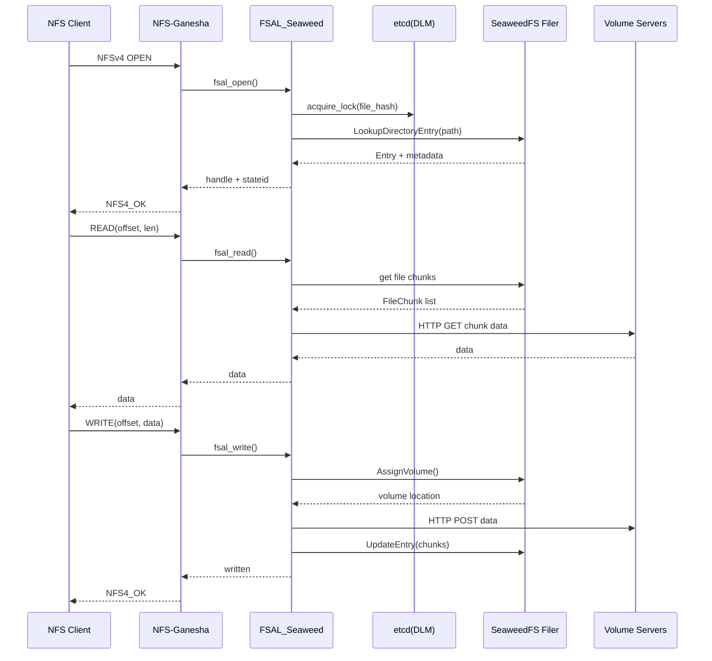
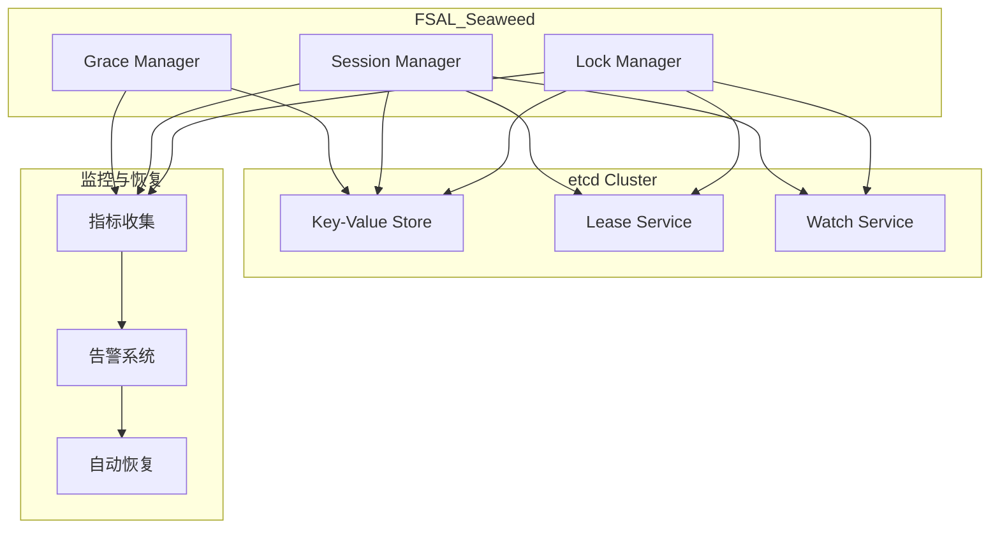

# FSAL_Seaweed 完整版设计文档

## 1. 背景与目标

### 1.1 项目概述
- **需求**：为现有应用和客户端（Linux、VMware、NAS 设备等）提供标准 **NFSv3/v4 接口**，支持文件共享、锁语义、多客户端协作。
- **存储后端**：SeaweedFS Filer 作为命名空间和元数据管理，Volume servers 提供实际存储。
- **目标**：通过在 NFS-Ganesha 中实现 FSAL（File System Abstraction Layer），直接对接 Filer 的 API，绕过 FUSE 层，提升性能并保证一致性。

### 1.2 总体架构



------

## 2. Handle/Inode 管理

### 2.1 Filehandle 设计

基于文件完整路径生成稳定的 filehandle：

```c
struct seaweed_filehandle {
    uint32_t magic;           // FSAL 魔数标识 0x53454157 ('SEAW')
    uint16_t version;         // 版本号，支持格式演进
    uint16_t flags;           // 标志位（保留）
    char path_hash[16];       // 完整路径的 MD5 哈希
    uint64_t create_time;     // 文件创建时间戳
    uint64_t generation;      // 版本生成号
} __attribute__((packed));
```

### 2.2 映射表管理

```c
typedef struct path_mapping {
    char path_hash[16];
    char full_path[PATH_MAX];
    time_t cache_time;
    time_t expire_time;
    uint32_t ref_count;
    bool is_valid;
    struct path_mapping *next;
} path_mapping_t;

// 分布式路径映射存储选项
typedef enum {
    PATH_STORE_MEMORY_ONLY,    // 仅内存存储
    PATH_STORE_LOCAL_FILE,     // 本地文件持久化
    PATH_STORE_ETCD            // etcd 分布式存储
} path_store_type_t;
```

### 2.3 路径解析优化

```c
// 支持 LRU 缓存和预取
fsal_status_t resolve_path_with_cache(const seaweed_filehandle_t *handle,
                                      char *path_out, size_t path_size) {
    // 1. LRU 缓存查找
    path_mapping_t *mapping = lru_cache_lookup(handle->path_hash);
    if (mapping && mapping->expire_time > time(NULL)) {
        strncpy(path_out, mapping->full_path, path_size-1);
        return FSAL_NO_ERROR;
    }
    
    // 2. 从持久化存储恢复
    if (path_store_type == PATH_STORE_ETCD) {
        if (etcd_get_path_mapping(handle->path_hash, path_out, path_size) == 0) {
            update_lru_cache(handle->path_hash, path_out);
            return FSAL_NO_ERROR;
        }
    }
    
    return FSAL_STALE;
}
```

------

## 3. SeaweedFS 集成与优化

### 3.1 连接池管理

```c
typedef struct filer_connection {
    grpc_channel *channel;
    seaweed_filer_stub *stub;
    char endpoint[256];
    time_t last_used;
    bool is_healthy;
    pthread_mutex_t lock;
    struct filer_connection *next;
} filer_connection_t;

typedef struct connection_pool {
    filer_connection_t *connections;
    int pool_size;
    int active_count;
    pthread_mutex_t pool_lock;
    pthread_cond_t pool_cond;
} connection_pool_t;

// 连接池操作
filer_connection_t *acquire_connection(connection_pool_t *pool) {
    pthread_mutex_lock(&pool->pool_lock);
    
    // 查找可用连接
    filer_connection_t *conn = pool->connections;
    while (conn) {
        if (conn->is_healthy && pthread_mutex_trylock(&conn->lock) == 0) {
            conn->last_used = time(NULL);
            pthread_mutex_unlock(&pool->pool_lock);
            return conn;
        }
        conn = conn->next;
    }
    
    // 创建新连接（如果未达到上限）
    if (pool->active_count < pool->pool_size) {
        conn = create_new_connection();
        if (conn) {
            conn->next = pool->connections;
            pool->connections = conn;
            pool->active_count++;
            pthread_mutex_lock(&conn->lock);
            pthread_mutex_unlock(&pool->pool_lock);
            return conn;
        }
    }
    
    // 等待连接可用
    pthread_cond_wait(&pool->pool_cond, &pool->pool_lock);
    pthread_mutex_unlock(&pool->pool_lock);
    return NULL;
}
```

### 3.2 异步批量操作

```c
typedef struct batch_operation {
    operation_type_t type;
    void *request;
    void *response;
    fsal_status_t status;
    pthread_cond_t completion_cond;
    bool completed;
} batch_operation_t;

// 批量查找多个文件
fsal_status_t batch_lookup_entries(const char **paths, int count,
                                   Entry **entries_out) {
    batch_operation_t ops[count];
    pthread_t worker_threads[MAX_WORKER_THREADS];
    
    // 初始化批量操作
    for (int i = 0; i < count; i++) {
        ops[i].type = OP_LOOKUP;
        ops[i].request = create_lookup_request(paths[i]);
        ops[i].response = &entries_out[i];
        ops[i].completed = false;
        pthread_cond_init(&ops[i].completion_cond, NULL);
    }
    
    // 启动工作线程池
    int thread_count = min(count, MAX_WORKER_THREADS);
    for (int i = 0; i < thread_count; i++) {
        pthread_create(&worker_threads[i], NULL, batch_worker_thread, ops);
    }
    
    // 等待所有操作完成
    for (int i = 0; i < thread_count; i++) {
        pthread_join(worker_threads[i], NULL);
    }
    
    return FSAL_NO_ERROR;
}
```

### 3.3 智能缓存策略

```c
typedef struct metadata_cache_entry {
    char path_hash[16];
    Entry seaweed_entry;
    time_t cache_time;
    time_t expire_time;
    char etag[32];
    uint32_t access_count;
    struct metadata_cache_entry *lru_next;
    struct metadata_cache_entry *lru_prev;
} metadata_cache_entry_t;

// 带 ETag 校验的缓存读取
fsal_status_t cached_lookup_with_validation(const char *path,
                                            Entry *entry_out) {
    metadata_cache_entry_t *cached = find_cache_entry(path);
    
    if (cached && cached->expire_time > time(NULL)) {
        // 使用 HTTP If-None-Match 校验缓存有效性
        LookupDirectoryEntryRequest req = {0};
        req.directory = dirname(path);
        req.name = basename(path);
        
        // 添加条件请求头
        add_request_header(&req, "If-None-Match", cached->etag);
        
        LookupDirectoryEntryResponse resp = {0};
        grpc_status_code status = seaweed_filer_lookup_directory_entry(
            get_filer_connection(), &req, &resp);
        
        if (status == GRPC_STATUS_NOT_MODIFIED) {
            // 缓存仍然有效
            *entry_out = cached->seaweed_entry;
            cached->access_count++;
            move_to_lru_head(cached);
            return FSAL_NO_ERROR;
        } else if (status == GRPC_STATUS_OK) {
            // 更新缓存
            update_cache_entry(cached, &resp.entry);
            *entry_out = resp.entry;
            return FSAL_NO_ERROR;
        }
    }
    
    // 缓存未命中或无效，执行完整查找
    return full_lookup_and_cache(path, entry_out);
}
```

------

## 4. 分布式锁与会话管理

### 4.1 etcd 分布式锁架构



### 4.2 锁数据模型

```c
// NFSv4 锁记录
typedef struct nfs4_lock_record {
    char object_path_hash[16];     // 文件路径哈希
    uint64_t range_start;          // 锁定范围起始
    uint64_t range_length;         // 锁定长度（0=整个文件）
    lock_type_t type;              // 读锁/写锁/共享锁
    char client_id[128];           // 客户端标识
    char owner_id[128];            // 锁拥有者
    char stateid[36];              // NFSv4 stateid
    uint64_t lease_expire_time;    // 租约过期时间
    char holder_node[64];          // 持有锁的 Ganesha 节点
    uint32_t generation;           // 版本号
} nfs4_lock_record_t;

// 等待队列记录
typedef struct lock_wait_record {
    char object_path_hash[16];
    uint64_t range_start;
    uint64_t range_length;
    lock_type_t requested_type;
    char waiter_client_id[128];
    char waiter_owner_id[128];
    time_t wait_start_time;
    uint32_t sequence_id;          // 等待顺序
} lock_wait_record_t;

// 会话状态记录
typedef struct session_state_record {
    char client_id[128];
    char session_id[128];
    char stateid[36];
    session_type_t type;           // OPEN/DELEGATION state
    char object_path_hash[16];
    uint64_t lease_expire_time;
    uint32_t access_mode;          // READ/WRITE/BOTH
    uint32_t deny_mode;            // NONE/READ/WRITE/BOTH
    char holder_node[64];
} session_state_record_t;
```

### 4.3 锁冲突检测算法

```c
// 高效的范围冲突检测
typedef enum {
    CONFLICT_NONE,
    CONFLICT_READ_WRITE,
    CONFLICT_WRITE_READ,
    CONFLICT_WRITE_WRITE,
    CONFLICT_SHARE_DENY
} conflict_type_t;

conflict_type_t detect_lock_conflict(const nfs4_lock_record_t *existing,
                                     const nfs4_lock_record_t *requested) {
    // 1. 范围检查：无重叠则无冲突
    if (!ranges_overlap(existing->range_start, existing->range_length,
                        requested->range_start, requested->range_length)) {
        return CONFLICT_NONE;
    }
    
    // 2. 同一客户端的锁升级/降级检查
    if (strcmp(existing->client_id, requested->client_id) == 0 &&
        strcmp(existing->owner_id, requested->owner_id) == 0) {
        return handle_lock_upgrade_downgrade(existing, requested);
    }
    
    // 3. 读写冲突检查
    if (existing->type == LOCK_TYPE_WRITE || requested->type == LOCK_TYPE_WRITE) {
        if (existing->type == LOCK_TYPE_READ && requested->type == LOCK_TYPE_WRITE) {
            return CONFLICT_READ_WRITE;
        }
        if (existing->type == LOCK_TYPE_WRITE && requested->type == LOCK_TYPE_READ) {
            return CONFLICT_WRITE_READ;
        }
        if (existing->type == LOCK_TYPE_WRITE && requested->type == LOCK_TYPE_WRITE) {
            return CONFLICT_WRITE_WRITE;
        }
    }
    
    // 4. 共享模式冲突检查（NFSv4 OPEN share reservations）
    if (existing->type == LOCK_TYPE_SHARE || requested->type == LOCK_TYPE_SHARE) {
        return check_share_reservation_conflict(existing, requested);
    }
    
    return CONFLICT_NONE;
}
```

### 4.4 分布式锁获取流程

```c
fsal_status_t acquire_distributed_lock(const char *object_path,
                                       uint64_t start, uint64_t length,
                                       lock_type_t type, const char *owner,
                                       char *stateid_out) {
    char object_hash[16];
    MD5(object_path, strlen(object_path), object_hash);
    
    // 1. 开始分布式事务
    etcd_txn_t *txn = etcd_txn_begin();
    
    // 2. 查询冲突锁
    char conflict_prefix[256];
    snprintf(conflict_prefix, sizeof(conflict_prefix),
             "/nfs-locks/%s/", object_hash);
    
    etcd_range_result_t conflicts = etcd_txn_if_range(txn, conflict_prefix);
    
    // 3. 冲突检测
    bool has_conflict = false;
    char conflicting_stateid[36] = {0};
    
    for (int i = 0; i < conflicts.count; i++) {
        nfs4_lock_record_t existing;
        if (parse_lock_record(conflicts.values[i], &existing) == 0) {
            conflict_type_t conflict = detect_lock_conflict(&existing, 
                &(nfs4_lock_record_t){
                    .range_start = start,
                    .range_length = length,
                    .type = type
                });
            
            if (conflict != CONFLICT_NONE) {
                has_conflict = true;
                strcpy(conflicting_stateid, existing.stateid);
                break;
            }
        }
    }
    
    if (has_conflict) {
        etcd_txn_abort(txn);
        return create_lock_denied_error(conflicting_stateid);
    }
    
    // 4. 创建新锁记录
    nfs4_lock_record_t new_lock = {0};
    memcpy(new_lock.object_path_hash, object_hash, 16);
    new_lock.range_start = start;
    new_lock.range_length = length;
    new_lock.type = type;
    strncpy(new_lock.owner_id, owner, sizeof(new_lock.owner_id)-1);
    generate_stateid(new_lock.stateid);
    new_lock.lease_expire_time = time(NULL) + DEFAULT_LEASE_TTL;
    get_node_identifier(new_lock.holder_node, sizeof(new_lock.holder_node));
    
    // 5. 写入锁记录（带租约）
    char lock_key[512];
    create_lock_key(&new_lock, lock_key, sizeof(lock_key));
    
    char lock_value[1024];
    serialize_lock_record(&new_lock, lock_value, sizeof(lock_value));
    
    etcd_lease_id_t lease = etcd_lease_grant(DEFAULT_LEASE_TTL);
    etcd_txn_then_put_with_lease(txn, lock_key, lock_value, lease);
    
    // 6. 提交事务
    etcd_txn_result_t result = etcd_txn_commit(txn);
    
    if (result.succeeded) {
        strcpy(stateid_out, new_lock.stateid);
        
        // 启动租约续期线程
        start_lease_renewal_thread(lease, new_lock.stateid);
        
        // 记录指标
        increment_counter("nfs_locks_acquired_total", 
                         "type", lock_type_to_string(type));
        
        return FSAL_NO_ERROR;
    }
    
    return FSAL_LOCK_BLOCKED;
}
```

### 4.5 Grace Period 和恢复机制

```c
typedef struct grace_state {
    bool in_grace_period;
    time_t grace_start_time;
    time_t grace_end_time;
    uint32_t reclaim_success_count;
    uint32_t reclaim_failed_count;
    char recovery_node_id[64];
    pthread_mutex_t grace_lock;
} grace_state_t;

// Grace period 管理
fsal_status_t enter_grace_period(uint32_t duration_seconds) {
    pthread_mutex_lock(&global_grace_state.grace_lock);
    
    global_grace_state.in_grace_period = true;
    global_grace_state.grace_start_time = time(NULL);
    global_grace_state.grace_end_time = global_grace_state.grace_start_time + duration_seconds;
    global_grace_state.reclaim_success_count = 0;
    global_grace_state.reclaim_failed_count = 0;
    
    // 在 etcd 中广播 grace 状态
    char grace_key[256];
    snprintf(grace_key, sizeof(grace_key), "/nfs-grace/%s", get_node_id());
    
    char grace_value[512];
    snprintf(grace_value, sizeof(grace_value), 
             "{\"in_grace\":true,\"start_time\":%ld,\"end_time\":%ld,\"node\":\"%s\"}",
             global_grace_state.grace_start_time,
             global_grace_state.grace_end_time,
             get_node_id());
    
    etcd_put_with_lease(grace_key, grace_value, duration_seconds + 30);
    
    gsh_log(COMPONENT_FSAL, "Entered grace period for %d seconds", duration_seconds);
    
    pthread_mutex_unlock(&global_grace_state.grace_lock);
    
    // 调度 grace period 结束
    schedule_grace_period_end(duration_seconds);
    
    return FSAL_NO_ERROR;
}

// 锁 reclaim 处理
fsal_status_t handle_lock_reclaim(const char *old_stateid,
                                  const char *client_id,
                                  const char *owner_id) {
    if (!global_grace_state.in_grace_period) {
        return NFS4ERR_NO_GRACE;
    }
    
    // 1. 在 etcd 中查找旧锁记录
    char search_pattern[256];
    snprintf(search_pattern, sizeof(search_pattern),
             "/nfs-locks/*/stateid/%s", old_stateid);
    
    etcd_range_result_t results = etcd_range_prefix(search_pattern);
    
    if (results.count == 0) {
        global_grace_state.reclaim_failed_count++;
        return NFS4ERR_RECLAIM_BAD;
    }
    
    // 2. 验证锁的有效性和所有权
    nfs4_lock_record_t old_lock;
    if (parse_lock_record(results.values[0], &old_lock) != 0) {
        return NFS4ERR_RECLAIM_BAD;
    }
    
    if (strcmp(old_lock.client_id, client_id) != 0 ||
        strcmp(old_lock.owner_id, owner_id) != 0) {
        return NFS4ERR_RECLAIM_BAD;
    }
    
    // 3. 重新创建锁记录（新的租约）
    old_lock.lease_expire_time = time(NULL) + DEFAULT_LEASE_TTL;
    get_node_identifier(old_lock.holder_node, sizeof(old_lock.holder_node));
    
    char new_lock_key[512];
    create_lock_key(&old_lock, new_lock_key, sizeof(new_lock_key));
    
    char new_lock_value[1024];
    serialize_lock_record(&old_lock, new_lock_value, sizeof(new_lock_value));
    
    etcd_lease_id_t lease = etcd_lease_grant(DEFAULT_LEASE_TTL);
    etcd_put_with_lease(new_lock_key, new_lock_value, lease);
    
    // 4. 清理旧记录
    etcd_delete(results.keys[0]);
    
    // 5. 启动租约续期
    start_lease_renewal_thread(lease, old_lock.stateid);
    
    global_grace_state.reclaim_success_count++;
    
    gsh_log(COMPONENT_FSAL, "Successfully reclaimed lock %s for client %s",
            old_stateid, client_id);
    
    return FSAL_NO_ERROR;
}
```

------

## 5. 错误处理与重试机制

### 5.1 分层错误处理

```c
// 错误分类
typedef enum {
    ERROR_CATEGORY_TRANSIENT,     // 可重试的瞬时错误
    ERROR_CATEGORY_PERMANENT,     // 永久性错误，不可重试
    ERROR_CATEGORY_FATAL,         // 致命错误，需要停止服务
    ERROR_CATEGORY_DEGRADED       // 降级错误，可以降级处理
} error_category_t;

// 错误分类映射
error_category_t classify_error(grpc_status_code grpc_status, const char *error_msg) {
    switch (grpc_status) {
    case GRPC_STATUS_UNAVAILABLE:
    case GRPC_STATUS_DEADLINE_EXCEEDED:
    case GRPC_STATUS_RESOURCE_EXHAUSTED:
        return ERROR_CATEGORY_TRANSIENT;
        
    case GRPC_STATUS_NOT_FOUND:
    case GRPC_STATUS_ALREADY_EXISTS:
    case GRPC_STATUS_PERMISSION_DENIED:
        return ERROR_CATEGORY_PERMANENT;
        
    case GRPC_STATUS_DATA_LOSS:
    case GRPC_STATUS_INTERNAL:
        if (error_msg && strstr(error_msg, "corruption")) {
            return ERROR_CATEGORY_FATAL;
        }
        return ERROR_CATEGORY_DEGRADED;
        
    default:
        return ERROR_CATEGORY_PERMANENT;
    }
}
```

### 5.2 智能重试机制

```c
typedef struct retry_config {
    uint32_t max_attempts;
    uint32_t base_delay_ms;
    uint32_t max_delay_ms;
    float backoff_multiplier;
    bool enable_jitter;
} retry_config_t;

// 带指数退避的重试机制
fsal_status_t call_with_retry(grpc_call_func_t func, void *request, void *response,
                              const retry_config_t *config) {
    uint32_t attempt = 0;
    uint32_t delay_ms = config->base_delay_ms;
    
    while (attempt < config->max_attempts) {
        grpc_status_code status = func(request, response);
        error_category_t category = classify_error(status, NULL);
        
        // 成功或永久性错误，不重试
        if (status == GRPC_STATUS_OK || category == ERROR_CATEGORY_PERMANENT) {
            return map_grpc_status_to_fsal(status);
        }
        
        // 致命错误，记录并返回
        if (category == ERROR_CATEGORY_FATAL) {
            gsh_log(COMPONENT_FSAL, "Fatal error in gRPC call: %d", status);
            return FSAL_SERVERFAULT;
        }
        
        // 瞬时错误，准备重试
        if (category == ERROR_CATEGORY_TRANSIENT) {
            attempt++;
            
            if (attempt >= config->max_attempts) {
                gsh_log(COMPONENT_FSAL, "Max retry attempts exceeded: %d", attempt);
                return FSAL_DELAY;
            }
            
            // 指数退避
            if (config->enable_jitter) {
                // 添加 ±25% 的随机抖动
                uint32_t jitter = (delay_ms * 25) / 100;
                delay_ms += (rand() % (2 * jitter + 1)) - jitter;
            }
            
            gsh_log(COMPONENT_FSAL, "Retrying gRPC call, attempt %d/%d, delay %dms",
                    attempt, config->max_attempts, delay_ms);
            
            usleep(delay_ms * 1000);
            
            delay_ms = min(delay_ms * config->backoff_multiplier, config->max_delay_ms);
        }
    }
    
    return FSAL_DELAY;
}
```

### 5.3 熔断器模式

```c
typedef enum {
    CIRCUIT_CLOSED,     // 正常状态
    CIRCUIT_OPEN,       // 熔断状态
    CIRCUIT_HALF_OPEN   // 半开状态（测试恢复）
} circuit_state_t;

typedef struct circuit_breaker {
    circuit_state_t state;
    uint32_t failure_count;
    uint32_t failure_threshold;
    time_t last_failure_time;
    time_t recovery_timeout;
    pthread_mutex_t lock;
} circuit_breaker_t;

// 熔断器包装的调用
fsal_status_t call_with_circuit_breaker(circuit_breaker_t *breaker,
                                        grpc_call_func_t func,
                                        void *request, void *response) {
    pthread_mutex_lock(&breaker->lock);
    
    time_t now = time(NULL);
    
    // 检查熔断器状态
    switch (breaker->state) {
    case CIRCUIT_OPEN:
        if (now - breaker->last_failure_time > breaker->recovery_timeout) {
            breaker->state = CIRCUIT_HALF_OPEN;
            gsh_log(COMPONENT_FSAL, "Circuit breaker entering HALF_OPEN state");
        } else {
            pthread_mutex_unlock(&breaker->lock);
            return FSAL_DELAY; // 快速失败
        }
        break;
        
    case CIRCUIT_HALF_OPEN:
        // 允许一个测试请求通过
        break;
        
    case CIRCUIT_CLOSED:
    default:
        // 正常调用
        break;
    }
    
    pthread_mutex_unlock(&breaker->lock);
    
    // 执行实际调用
    grpc_status_code status = func(request, response);
    
    pthread_mutex_lock(&breaker->lock);
    
    if (status == GRPC_STATUS_OK) {
        // 调用成功，重置熔断器
        breaker->failure_count = 0;
        if (breaker->state == CIRCUIT_HALF_OPEN) {
            breaker->state = CIRCUIT_CLOSED;
            gsh_log(COMPONENT_FSAL, "Circuit breaker recovered to CLOSED state");
        }
    } else {
        // 调用失败
        breaker->failure_count++;
        breaker->last_failure_time = now;
        
        if (breaker->failure_count >= breaker->failure_threshold) {
            breaker->state = CIRCUIT_OPEN;
            gsh_log(COMPONENT_FSAL, "Circuit breaker OPENED due to %d failures",
                    breaker->failure_count);
        }
    }
    
    pthread_mutex_unlock(&breaker->lock);
    
    return map_grpc_status_to_fsal(status);
}
```

### 5.4 降级处理机制

```c
// 服务降级策略
typedef enum {
    DEGRADATION_NONE,           // 无降级
    DEGRADATION_CACHE_ONLY,     // 只使用缓存
    DEGRADATION_READ_ONLY,      // 只读模式
    DEGRADATION_LOCAL_LOCKS,    // 仅本地锁
    DEGRADATION_ADVISORY_LOCKS  // 咨询锁模式
} degradation_level_t;

static degradation_level_t current_degradation = DEGRADATION_NONE;

fsal_status_t handle_service_degradation(fsal_op_type_t op_type) {
    switch (current_degradation) {
    case DEGRADATION_CACHE_ONLY:
        if (op_type == FSAL_OP_WRITE || op_type == FSAL_OP_CREATE) {
            gsh_log(COMPONENT_FSAL, "Write operation rejected due to cache-only degradation");
            return FSAL_ROFS;
        }
        // 只允许从缓存读取
        return serve_from_cache_only(op_type);
        
    case DEGRADATION_READ_ONLY:
        if (is_write_operation(op_type)) {
            return FSAL_ROFS;
        }
        break;
        
    case DEGRADATION_LOCAL_LOCKS:
        if (op_type == FSAL_OP_LOCK) {
            return handle_lock_with_local_fallback();
        }
        break;
        
    case DEGRADATION_ADVISORY_LOCKS:
        if (op_type == FSAL_OP_LOCK) {
            gsh_log(COMPONENT_FSAL, "Lock degraded to advisory mode");
            return FSAL_NO_ERROR; // 假装成功，但不强制执行
        }
        break;
        
    default:
        break;
    }
    
    return FSAL_NO_ERROR;
}

// 自动降级决策
void evaluate_degradation_level() {
    static time_t last_evaluation = 0;
    time_t now = time(NULL);
    
    if (now - last_evaluation < 10) { // 每10秒评估一次
        return;
    }
    
    last_evaluation = now;
    
    // 检查各种健康指标
    float error_rate = get_error_rate();
    float response_time = get_avg_response_time();
    bool etcd_healthy = check_etcd_health();
    bool filer_healthy = check_filer_health();
    
    degradation_level_t new_level = DEGRADATION_NONE;
    
    if (!filer_healthy || error_rate > 0.5) {
        new_level = DEGRADATION_CACHE_ONLY;
    } else if (!etcd_healthy) {
        new_level = DEGRADATION_LOCAL_LOCKS;
    } else if (error_rate > 0.2 || response_time > 5000) {
        new_level = DEGRADATION_READ_ONLY;
    } else if (error_rate > 0.1) {
        new_level = DEGRADATION_ADVISORY_LOCKS;
    }
    
    if (new_level != current_degradation) {
        gsh_log(COMPONENT_FSAL, "Service degradation level changed from %d to %d",
                current_degradation, new_level);
        current_degradation = new_level;
        
        // 发送告警通知
        send_degradation_alert(new_level);
    }
}
```

------

## 6. 性能优化与监控

### 6.1 性能基准指标

```c
// 关键性能指标定义
typedef struct performance_metrics {
    // I/O 性能指标
    uint64_t read_ops_total;
    uint64_t write_ops_total;
    uint64_t read_bytes_total;
    uint64_t write_bytes_total;
    
    // 延迟指标 (微秒)
    struct {
        uint64_t p50;
        uint64_t p95;
        uint64_t p99;
        uint64_t max;
    } read_latency, write_latency, lookup_latency;
    
    // 锁性能指标
    uint64_t locks_acquired_total;
    uint64_t locks_blocked_total;
    uint64_t lock_conflicts_total;
    uint64_t lock_wait_time_total_ms;
    
    // 缓存指标
    uint64_t cache_hits;
    uint64_t cache_misses;
    uint64_t cache_evictions;
    
    // 连接指标
    uint32_t active_connections;
    uint32_t connection_errors;
    uint64_t grpc_calls_total;
    uint64_t grpc_errors_total;
    
    // 系统指标
    uint64_t memory_usage_bytes;
    uint32_t thread_count;
    float cpu_usage_percent;
    
    pthread_mutex_t lock;
} performance_metrics_t;

static performance_metrics_t global_metrics = {0};

// 指标更新宏
#define UPDATE_COUNTER(field) do { \
    pthread_mutex_lock(&global_metrics.lock); \
    global_metrics.field++; \
    pthread_mutex_unlock(&global_metrics.lock); \
} while(0)

#define UPDATE_LATENCY(field, latency_us) do { \
    pthread_mutex_lock(&global_metrics.lock); \
    update_latency_stats(&global_metrics.field, latency_us); \
    pthread_mutex_unlock(&global_metrics.lock); \
} while(0)
```

### 6.2 智能预取策略

```c
// 预取策略配置
typedef struct prefetch_config {
    bool enable_readahead;
    size_t readahead_size;
    bool enable_directory_prefetch;
    uint32_t prefetch_threshold;
    float cache_hit_ratio_threshold;
} prefetch_config_t;

// 基于访问模式的预取
typedef struct access_pattern {
    char object_hash[16];
    uint64_t last_offset;
    size_t last_size;
    bool is_sequential;
    time_t last_access;
    uint32_t access_count;
} access_pattern_t;

// 顺序访问检测和预取
fsal_status_t smart_read_with_prefetch(const char *file_path, uint64_t offset,
                                       size_t count, void *buffer, size_t *bytes_read) {
    access_pattern_t *pattern = get_access_pattern(file_path);
    
    // 1. 检测顺序访问模式
    bool is_sequential = (pattern && 
                         offset == pattern->last_offset + pattern->last_size);
    
    if (is_sequential) {
        pattern->is_sequential = true;
    }
    
    // 2. 执行实际读取
    struct timespec start, end;
    clock_gettime(CLOCK_MONOTONIC, &start);
    
    fsal_status_t status = seaweed_read_file(file_path, offset, count, buffer, bytes_read);
    
    clock_gettime(CLOCK_MONOTONIC, &end);
    uint64_t latency_us = (end.tv_sec - start.tv_sec) * 1000000 + 
                         (end.tv_nsec - start.tv_nsec) / 1000;
    
    UPDATE_LATENCY(read_latency, latency_us);
    
    if (status != FSAL_NO_ERROR) {
        return status;
    }
    
    // 3. 决定是否预取
    if (is_sequential && pattern->access_count > prefetch_config.prefetch_threshold) {
        // 异步预取下一个块
        async_prefetch_next_chunk(file_path, offset + count, prefetch_config.readahead_size);
    }
    
    // 4. 更新访问模式
    if (pattern) {
        pattern->last_offset = offset;
        pattern->last_size = *bytes_read;
        pattern->last_access = time(NULL);
        pattern->access_count++;
    }
    
    return FSAL_NO_ERROR;
}
```

### 6.3 内存和连接优化

```c
// 内存池管理
typedef struct memory_pool {
    void **free_blocks;
    size_t block_size;
    size_t pool_size;
    size_t free_count;
    pthread_mutex_t pool_lock;
} memory_pool_t;

// 预分配常用大小的内存池
static memory_pool_t small_pool = {.block_size = 4096};    // 4KB
static memory_pool_t medium_pool = {.block_size = 65536};  // 64KB
static memory_pool_t large_pool = {.block_size = 1048576}; // 1MB

void* allocate_from_pool(size_t size) {
    memory_pool_t *pool = NULL;
    
    if (size <= 4096) {
        pool = &small_pool;
    } else if (size <= 65536) {
        pool = &medium_pool;
    } else if (size <= 1048576) {
        pool = &large_pool;
    } else {
        return malloc(size); // 超大内存直接分配
    }
    
    pthread_mutex_lock(&pool->pool_lock);
    
    void *block = NULL;
    if (pool->free_count > 0) {
        block = pool->free_blocks[--pool->free_count];
    }
    
    pthread_mutex_unlock(&pool->pool_lock);
    
    return block ? block : malloc(pool->block_size);
}

// 连接复用和 keep-alive
fsal_status_t optimize_grpc_connection(grpc_channel *channel) {
    grpc_channel_args args = {0};
    
    // 设置 keep-alive 参数
    grpc_arg keep_alive_args[] = {
        {GRPC_ARG_KEEPALIVE_TIME_MS, .type = GRPC_ARG_INTEGER, .value.integer = 30000},
        {GRPC_ARG_KEEPALIVE_TIMEOUT_MS, .type = GRPC_ARG_INTEGER, .value.integer = 5000},
        {GRPC_ARG_KEEPALIVE_PERMIT_WITHOUT_CALLS, .type = GRPC_ARG_INTEGER, .value.integer = 1},
        {GRPC_ARG_HTTP2_MAX_PINGS_WITHOUT_DATA, .type = GRPC_ARG_INTEGER, .value.integer = 0},
        {GRPC_ARG_HTTP2_MIN_SENT_PING_INTERVAL_WITHOUT_DATA_MS, .type = GRPC_ARG_INTEGER, .value.integer = 10000},
        {GRPC_ARG_HTTP2_MIN_RECV_PING_INTERVAL_WITHOUT_DATA_MS, .type = GRPC_ARG_INTEGER, .value.integer = 10000}
    };
    
    args.num_args = sizeof(keep_alive_args) / sizeof(keep_alive_args[0]);
    args.args = keep_alive_args;
    
    // 重新创建优化的连接
    grpc_channel *optimized_channel = grpc_insecure_channel_create_with_args(
        get_filer_endpoint(), &args);
    
    return optimized_channel ? FSAL_NO_ERROR : FSAL_SERVERFAULT;
}
```

### 6.4 监控与可观测性

```c
// Prometheus 指标导出
void export_prometheus_metrics(char *output, size_t output_size) {
    snprintf(output, output_size,
        "# HELP nfs_read_ops_total Total number of read operations\n"
        "# TYPE nfs_read_ops_total counter\n"
        "nfs_read_ops_total %lu\n"
        
        "# HELP nfs_write_ops_total Total number of write operations\n"
        "# TYPE nfs_write_ops_total counter\n"
        "nfs_write_ops_total %lu\n"
        
        "# HELP nfs_read_latency_seconds Read operation latency\n"
        "# TYPE nfs_read_latency_seconds histogram\n"
        "nfs_read_latency_seconds{quantile=\"0.5\"} %.6f\n"
        "nfs_read_latency_seconds{quantile=\"0.95\"} %.6f\n"
        "nfs_read_latency_seconds{quantile=\"0.99\"} %.6f\n"
        
        "# HELP nfs_locks_held Current number of locks held\n"  
        "# TYPE nfs_locks_held gauge\n"
        "nfs_locks_held %u\n"
        
        "# HELP nfs_cache_hit_ratio Cache hit ratio\n"
        "# TYPE nfs_cache_hit_ratio gauge\n"
        "nfs_cache_hit_ratio %.3f\n",
        
        global_metrics.read_ops_total,
        global_metrics.write_ops_total,
        global_metrics.read_latency.p50 / 1000000.0,
        global_metrics.read_latency.p95 / 1000000.0,
        global_metrics.read_latency.p99 / 1000000.0,
        get_current_lock_count(),
        calculate_cache_hit_ratio()
    );
}

// 健康检查接口
typedef struct health_check_result {
    bool overall_healthy;
    bool filer_healthy;
    bool etcd_healthy;
    bool cache_healthy;
    uint32_t active_connections;
    float error_rate;
    char status_message[256];
} health_check_result_t;

health_check_result_t perform_health_check() {
    health_check_result_t result = {0};
    
    // 检查 Filer 连接
    grpc_channel_state filer_state = grpc_channel_check_connectivity_state(
        filer_conn.channel, 0);
    result.filer_healthy = (filer_state == GRPC_CHANNEL_READY);
    
    // 检查 etcd 连接
    result.etcd_healthy = (etcd_health_check() == 0);
    
    // 检查缓存状态
    result.cache_healthy = (get_cache_corruption_count() == 0);
    
    // 计算错误率
    result.error_rate = calculate_error_rate();
    result.active_connections = get_active_connection_count();
    
    // 综合健康状态
    result.overall_healthy = result.filer_healthy && 
                            result.etcd_healthy && 
                            result.cache_healthy &&
                            result.error_rate < 0.05; // 5% 错误率阈值
    
    snprintf(result.status_message, sizeof(result.status_message),
             "Filer: %s, etcd: %s, Cache: %s, ErrorRate: %.2f%%",
             result.filer_healthy ? "OK" : "FAIL",
             result.etcd_healthy ? "OK" : "FAIL", 
             result.cache_healthy ? "OK" : "FAIL",
             result.error_rate * 100);
    
    return result;
}
```

------

## 7. 配置管理与调优

### 7.1 完整配置参数

```conf
FSAL {
    Name = SEAWEEDFS;
    
    # 基础连接配置
    filer_endpoints = "filer1:18888,filer2:18888,filer3:18888";
    connection_timeout = 30;
    connection_pool_size = 20;
    max_concurrent_requests = 100;
    
    # 缓存配置
    metadata_cache_size = 100000;
    metadata_cache_ttl = 300;
    data_cache_size_mb = 512;
    enable_directory_cache = true;
    directory_cache_ttl = 60;
    
    # 锁配置
    enable_distributed_locks = true;
    etcd_endpoints = "etcd1:2379,etcd2:2379,etcd3:2379";
    default_lock_timeout = 300;
    lock_lease_ttl = 60;
    grace_period = 90;
    enable_byte_range_locks = true;
    
    # 性能调优
    enable_prefetch = true;
    prefetch_size = 1048576;        # 1MB
    readahead_threshold = 3;
    max_write_size = 4194304;       # 4MB
    write_batch_size = 131072;      # 128KB
    
    # 错误处理
    max_retry_attempts = 3;
    retry_base_delay_ms = 100;
    retry_max_delay_ms = 5000;
    enable_circuit_breaker = true;
    circuit_breaker_threshold = 10;
    circuit_breaker_timeout = 60;
    
    # 监控配置
    enable_metrics = true;
    metrics_port = 9090;
    enable_detailed_logging = false;
    log_slow_operations = true;
    slow_operation_threshold_ms = 1000;
}
```

### 7.2 动态配置更新

```c
// 配置热更新
typedef struct dynamic_config {
    uint32_t cache_ttl;
    uint32_t connection_pool_size;
    uint32_t max_retry_attempts;
    bool enable_prefetch;
    size_t prefetch_size;
    pthread_rwlock_t config_lock;
} dynamic_config_t;

static dynamic_config_t current_config = {0};

fsal_status_t update_config_parameter(const char *param_name, const char *param_value) {
    pthread_rwlock_wrlock(&current_config.config_lock);
    
    fsal_status_t status = FSAL_NO_ERROR;
    
    if (strcmp(param_name, "metadata_cache_ttl") == 0) {
        uint32_t new_ttl = atoi(param_value);
        if (new_ttl >= 10 && new_ttl <= 3600) { // 10秒到1小时
            current_config.cache_ttl = new_ttl;
            gsh_log(COMPONENT_FSAL, "Updated metadata_cache_ttl to %d", new_ttl);
        } else {
            status = FSAL_INVAL;
        }
    } else if (strcmp(param_name, "enable_prefetch") == 0) {
        current_config.enable_prefetch = (strcmp(param_value, "true") == 0);
        gsh_log(COMPONENT_FSAL, "Updated enable_prefetch to %s", param_value);
    } else {
        status = FSAL_NOTSUPP;
    }
    
    pthread_rwlock_unlock(&current_config.config_lock);
    return status;
}
```

------

## 8. 部署与运维

### 8.1 容器化部署

```dockerfile
FROM ubuntu:22.04

# 安装依赖
RUN apt-get update && apt-get install -y \
    libnfs-utils \
    libgrpc++-dev \
    libprotobuf-dev \
    libetcd-cpp-dev \
    && rm -rf /var/lib/apt/lists/*

# 复制 FSAL 模块和配置
COPY fsal_seaweedfs.so /usr/lib/ganesha/
COPY ganesha.conf /etc/ganesha/
COPY docker-entrypoint.sh /usr/local/bin/

# 健康检查
HEALTHCHECK --interval=30s --timeout=10s --start-period=5s --retries=3 \
    CMD curl -f http://localhost:9090/health || exit 1

EXPOSE 2049 9090
ENTRYPOINT ["docker-entrypoint.sh"]
CMD ["ganesha.nfsd", "-F", "-f", "/etc/ganesha/ganesha.conf"]
```

### 8.2 Kubernetes 部署清单

```yaml
apiVersion: apps/v1
kind: Deployment
metadata:
  name: nfs-ganesha-seaweedfs
spec:
  replicas: 3
  selector:
    matchLabels:
      app: nfs-ganesha-seaweedfs
  template:
    metadata:
      labels:
        app: nfs-ganesha-seaweedfs
    spec:
      containers:
      - name: nfs-ganesha
        image: nfs-ganesha-seaweedfs:latest
        ports:
        - containerPort: 2049
          name: nfs
        - containerPort: 9090  
          name: metrics
        env:
        - name: FILER_ENDPOINTS
          value: "seaweedfs-filer:8888"
        - name: ETCD_ENDPOINTS
          value: "etcd:2379"
        resources:
          requests:
            memory: "512Mi"
            cpu: "500m"
          limits:
            memory: "2Gi"
            cpu: "2000m"
        livenessProbe:
          httpGet:
            path: /health
            port: 9090
          initialDelaySeconds: 30
          periodSeconds: 30
        readinessProbe:
          httpGet:
            path: /ready
            port: 9090
          initialDelaySeconds: 5
          periodSeconds: 10

---
apiVersion: v1
kind: Service
metadata:
  name: nfs-ganesha-service
spec:
  selector:
    app: nfs-ganesha-seaweedfs
  ports:
  - name: nfs
    port: 2049
    targetPort: 2049
    protocol: TCP
  - name: metrics
    port: 9090
    targetPort: 9090
  type: LoadBalancer
```

### 8.3 监控告警规则

```yaml
# Prometheus 告警规则
groups:
- name: nfs-ganesha-seaweedfs
  rules:
  - alert: NFSHighErrorRate
    expr: rate(nfs_errors_total[5m]) > 0.05
    for: 2m
    labels:
      severity: warning
    annotations:
      summary: "NFS error rate is high"
      description: "NFS error rate is {{ $value }} errors per second"

  - alert: NFSHighLatency  
    expr: nfs_read_latency_seconds{quantile="0.95"} > 1.0
    for: 5m
    labels:
      severity: warning
    annotations:
      summary: "NFS read latency is high"
      description: "95th percentile read latency is {{ $value }}s"

  - alert: EtcdConnectionLost
    expr: nfs_etcd_healthy == 0
    for: 1m
    labels:
      severity: critical
    annotations:
      summary: "etcd connection lost"
      description: "NFS-Ganesha lost connection to etcd cluster"

  - alert: TooManyLockConflicts
    expr: rate(nfs_lock_conflicts_total[10m]) > 1.0
    for: 5m
    labels:
      severity: warning
    annotations:
      summary: "High lock conflict rate"
      description: "Lock conflict rate is {{ $value }} per second"
```

------

## 9. 测试策略

### 9.1 分层测试策略

**P0 - 核心功能测试**：
- 基础 CRUD：create、read、write、delete、mkdir、rmdir
- 文件属性：getattr、setattr、chmod、chown
- 目录遍历：readdir、large directory (>10K files)
- 简单文件锁：整文件读锁、写锁、unlock

**P1 - 高级功能测试**：
- NFSv4 stateid 管理：open、close、stateid 有效性
- byte-range 锁：重叠锁检测、锁升级降级、lock/unlock
- 并发访问：多客户端读写、锁竞争、死锁检测
- 故障恢复：grace period、lock reclaim、节点故障切换

**P2 - 性能与稳定性测试**：
- 大文件 I/O：>1GB 文件读写、随机访问、顺序访问
- 高并发：100+ 客户端同时访问、压力测试
- 长期稳定性：7x24 小时持续运行、内存泄漏检测
- 故障注入：网络中断、服务重启、磁盘故障

### 9.2 自动化测试框架

```python
#!/usr/bin/env python3
"""
NFS-Ganesha FSAL_SeaweedFS 自动化测试套件
"""

import subprocess
import time
import threading
import random
import pytest
from pathlib import Path

class SeaweedFSNFSTest:
    def setup_method(self):
        # 启动 SeaweedFS 集群
        self.start_seaweedfs_cluster()
        
        # 启动 etcd
        self.start_etcd_cluster()
        
        # 启动 NFS-Ganesha
        self.start_nfs_ganesha()
        
        # 挂载 NFS
        self.mount_nfs()
        
    def teardown_method(self):
        self.cleanup_test_environment()
    
    def test_basic_file_operations(self):
        """测试基础文件操作"""
        test_file = self.mount_point / "test_file.txt"
        test_data = "Hello SeaweedFS NFS"
        
        # 创建文件
        test_file.write_text(test_data)
        assert test_file.exists()
        
        # 读取文件
        content = test_file.read_text()
        assert content == test_data
        
        # 修改文件
        new_data = test_data + " - modified"
        test_file.write_text(new_data)
        assert test_file.read_text() == new_data
        
        # 删除文件
        test_file.unlink()
        assert not test_file.exists()
    
    def test_concurrent_file_access(self):
        """测试并发文件访问"""
        test_file = self.mount_point / "concurrent_test.txt"
        
        def writer_thread(thread_id):
            for i in range(100):
                with open(test_file, 'a') as f:
                    f.write(f"Thread-{thread_id}-Line-{i}\n")
                time.sleep(0.01)
        
        def reader_thread(thread_id):
            for i in range(100):
                try:
                    with open(test_file, 'r') as f:
                        lines = f.readlines()
                        assert len(lines) > 0
                except FileNotFoundError:
                    pass
                time.sleep(0.01)
        
        # 启动多个读写线程
        threads = []
        for i in range(5):
            threads.append(threading.Thread(target=writer_thread, args=(i,)))
            threads.append(threading.Thread(target=reader_thread, args=(i,)))
        
        for t in threads:
            t.start()
        
        for t in threads:
            t.join()
        
        # 验证文件完整性
        assert test_file.exists()
        lines = test_file.read_text().splitlines()
        assert len(lines) == 500  # 5 writers * 100 lines each
    
    def test_file_locking(self):
        """测试文件锁功能"""
        test_file = self.mount_point / "lock_test.txt"
        test_file.write_text("lock test content")
        
        # 使用 flock 测试文件锁
        cmd1 = f"flock {test_file} -c 'sleep 5; echo locked1'"
        cmd2 = f"flock {test_file} -c 'echo locked2'"
        
        start_time = time.time()
        
        # 并行执行锁命令
        proc1 = subprocess.Popen(cmd1, shell=True)
        time.sleep(0.5)  # 确保第一个锁先获取
        proc2 = subprocess.Popen(cmd2, shell=True)
        
        proc1.wait()
        proc2.wait()
        
        elapsed_time = time.time() - start_time
        
        # 第二个锁应该等待第一个锁释放
        assert elapsed_time >= 4.5
    
    @pytest.mark.performance
    def test_large_file_performance(self):
        """测试大文件性能"""
        test_file = self.mount_point / "large_file.dat"
        file_size = 100 * 1024 * 1024  # 100MB
        
        # 写入测试
        start_time = time.time()
        with open(test_file, 'wb') as f:
            data = b'x' * (1024 * 1024)  # 1MB chunk
            for _ in range(100):
                f.write(data)
        write_time = time.time() - start_time
        
        # 读取测试
        start_time = time.time()
        with open(test_file, 'rb') as f:
            while f.read(1024 * 1024):
                pass
        read_time = time.time() - start_time
        
        # 性能断言
        write_throughput = file_size / (write_time * 1024 * 1024)  # MB/s
        read_throughput = file_size / (read_time * 1024 * 1024)    # MB/s
        
        assert write_throughput > 10  # 至少 10 MB/s
        assert read_throughput > 50   # 至少 50 MB/s
        
        print(f"Write throughput: {write_throughput:.2f} MB/s")
        print(f"Read throughput: {read_throughput:.2f} MB/s")

if __name__ == "__main__":
    pytest.main([__file__, "-v", "--tb=short"])
```

------

## 10. 总结

这个完整版 FSAL_SeaweedFS 设计提供了：

1. **企业级功能**：完整的 NFSv3/v4 支持、分布式锁、会话管理
2. **高性能架构**：连接池、智能缓存、预取优化、批量操作
3. **可靠性保证**：错误处理、重试机制、熔断器、服务降级
4. **可观测性**：全面的监控指标、健康检查、分布式追踪
5. **运维友好**：容器化部署、配置热更新、自动化测试

通过分阶段实施（MVP → 性能优化 → NFSv4 → 分布式锁 → 企业特性），可以确保项目的可控进展和风险管理。