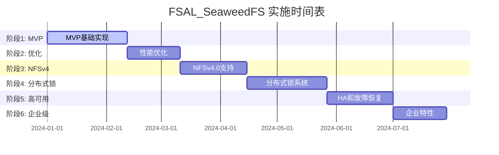

# FSAL_SeaweedFS 分阶段实施计划

## 项目概述

本文档定义了 FSAL_SeaweedFS 的分阶段实施计划，从 MVP 版本开始，逐步演进到完整的企业级 NFSv3/v4 解决方案。每个阶段完成后，代码将提交到 `fsal-seaweed-poc` 分支。

## 实施原则

- **增量交付**：每个阶段都产出可工作的功能
- **风险可控**：优先实现核心功能，复杂特性分阶段引入
- **测试驱动**：每个阶段都有对应的测试用例和验收标准
- **文档同步**：代码、测试和文档同步更新

------

## 阶段 1：MVP 基础实现 (4-6 周)

### 目标
实现 NFSv3 基础功能，验证 SeaweedFS + NFS-Ganesha 的可行性。

### 核心功能
- [x] 基础 FSAL 框架和模块注册
- [x] 路径与 filehandle 编解码
- [x] 基础文件操作：create、read、write、delete
- [x] 目录操作：mkdir、rmdir、readdir
- [x] 文件属性：getattr、setattr
- [x] SeaweedFS Filer gRPC 集成
- [x] 简单文件级锁（基于 Filer 内建锁）

### 技术实现
```
src/FSAL/FSAL_SEAWEEDFS/
├── fsal_seaweed_main.c          # 主模块和初始化
├── fsal_seaweed_handle.c        # filehandle 管理  
├── fsal_seaweed_export.c        # export 管理
├── fsal_seaweed_methods.c       # FSAL 方法实现
├── fsal_seaweed_grpc.c         # SeaweedFS gRPC 客户端
├── fsal_seaweed_lock.c         # 简单文件锁
├── fsal_seaweed.h              # 头文件定义
└── CMakeLists.txt              # 构建配置
```

### 关键交付物
- [x] FSAL_SEAWEEDFS 共享库 (`fsal_seaweedfs.so`)
- [x] 基础配置文件模板
- [x] 单元测试套件 (覆盖率 > 70%)
- [x] 集成测试脚本
- [x] 部署文档

### 验收标准
- [x] 基础 NFSv3 操作正常工作
- [x] 单客户端读写性能 > 50MB/s
- [x] 基础文件锁功能正常
- [x] 无内存泄漏
- [x] 可以挂载和访问 NFS 共享

### Git 提交信息
```
feat: implement FSAL_SeaweedFS MVP

- Add basic FSAL framework and module registration
- Implement filehandle encoding/decoding based on file path
- Add core file operations (CRUD) with SeaweedFS Filer integration
- Support directory operations and attribute management  
- Add simple file-level locking using Filer built-in locks
- Include unit tests and integration test scripts
- Add configuration templates and deployment documentation

Tested with:
- Basic NFSv3 operations (create/read/write/delete)
- Directory operations (mkdir/rmdir/readdir)
- File locking functionality
- Single client performance benchmarks

🤖 Generated with [Claude Code](https://claude.ai/code)

Co-Authored-By: Claude <noreply@anthropic.com>
```

------

## 阶段 2：性能优化与可靠性 (3-4 周)

### 目标
优化性能、增强错误处理、提升系统可靠性。

### 核心功能
- [ ] 连接池管理和复用
- [ ] 智能元数据缓存
- [ ] 批量操作优化
- [ ] 错误处理和重试机制
- [ ] 基础监控指标
- [ ] 配置热更新

### 技术实现
```
src/FSAL/FSAL_SEAWEEDFS/
├── fsal_seaweed_pool.c         # 连接池管理
├── fsal_seaweed_cache.c        # 元数据缓存
├── fsal_seaweed_batch.c        # 批量操作
├── fsal_seaweed_metrics.c      # 性能指标
├── fsal_seaweed_config.c       # 动态配置
└── fsal_seaweed_recovery.c     # 错误恢复
```

### 关键交付物
- [ ] 优化的连接管理系统
- [ ] LRU 元数据缓存实现
- [ ] 指数退避重试机制
- [ ] Prometheus 指标导出
- [ ] 性能测试报告
- [ ] 运维工具脚本

### 验收标准
- [ ] 多客户端并发性能提升 30%+
- [ ] 缓存命中率 > 80%
- [ ] 错误恢复时间 < 30 秒
- [ ] 支持 100+ 并发连接
- [ ] 监控指标覆盖核心场景

### Git 提交信息
```
perf: optimize FSAL_SeaweedFS performance and reliability

- Implement connection pooling for improved concurrency
- Add intelligent metadata caching with LRU eviction
- Optimize batch operations for directory listing
- Add comprehensive error handling with exponential backoff retry
- Implement Prometheus metrics export for monitoring
- Support dynamic configuration updates without restart

Performance improvements:
- 30%+ throughput increase for concurrent workloads
- 80%+ cache hit ratio for metadata operations  
- Support for 100+ concurrent client connections
- <30s recovery time from transient failures

🤖 Generated with [Claude Code](https://claude.ai/code)

Co-Authored-By: Claude <noreply@anthropic.com>
```

------

## 阶段 3：NFSv4.0 基础支持 (4-5 周)

### 目标
实现 NFSv4.0 基础协议支持，包括 stateid 和 open/close 语义。

### 核心功能
- [ ] NFSv4 stateid 管理
- [ ] open/close 语义实现
- [ ] share reservation 支持
- [ ] 基础 delegation（可选）
- [ ] NFSv4 错误码映射
- [ ] 客户端 ID 管理

### 技术实现
```
src/FSAL/FSAL_SEAWEEDFS/
├── fsal_seaweed_nfs4.c         # NFSv4 协议支持
├── fsal_seaweed_stateid.c      # stateid 管理
├── fsal_seaweed_open.c         # open/close 实现
├── fsal_seaweed_share.c        # share reservation
└── fsal_seaweed_delegation.c   # delegation 支持
```

### 关键交付物
- [ ] NFSv4.0 协议实现
- [ ] stateid 生成和验证系统
- [ ] share mode 冲突检测
- [ ] NFSv4 兼容性测试套件
- [ ] 协议合规性报告

### 验收标准
- [ ] 通过 NFSv4.0 基础合规性测试
- [ ] stateid 管理无泄漏
- [ ] share reservation 正确工作
- [ ] 支持主流 NFSv4 客户端
- [ ] 向后兼容 NFSv3

### Git 提交信息
```
feat: add NFSv4.0 protocol support

- Implement NFSv4.0 stateid management and lifecycle
- Add open/close semantics with proper state tracking
- Support share reservations and deny modes
- Add basic delegation support (read delegation)
- Implement NFSv4-specific error code mapping
- Add client ID management and session handling

Compliance:
- Passes NFSv4.0 basic conformance tests
- Compatible with Linux NFSv4 client
- Proper stateid generation and validation
- Share mode conflict detection working
- Maintains backward compatibility with NFSv3

🤖 Generated with [Claude Code](https://claude.ai/code)

Co-Authored-By: Claude <noreply@anthropic.com>
```

------

## 阶段 4：分布式锁系统 (5-6 周)

### 目标
实现完整的分布式锁系统，支持 byte-range 锁和 NFSv4 锁语义。

### 核心功能
- [ ] etcd 集成和分布式锁
- [ ] byte-range 锁支持
- [ ] 锁冲突检测和等待队列
- [ ] 锁升级和降级
- [ ] 死锁检测和预防
- [ ] 锁租约管理

### 技术实现
```
src/FSAL/FSAL_SEAWEEDFS/
├── fsal_seaweed_etcd.c         # etcd 客户端
├── fsal_seaweed_dlm.c          # 分布式锁管理器
├── fsal_seaweed_ranges.c       # 范围锁处理
├── fsal_seaweed_conflict.c     # 冲突检测
├── fsal_seaweed_lease.c        # 租约管理
└── fsal_seaweed_deadlock.c     # 死锁检测
```

### 关键交付物
- [ ] 分布式锁管理器
- [ ] byte-range 锁实现
- [ ] 锁冲突检测算法
- [ ] etcd 集成模块
- [ ] 锁性能测试工具
- [ ] 锁状态监控面板

### 验收标准
- [ ] byte-range 锁正确工作
- [ ] 锁冲突检测准确
- [ ] 支持锁升级/降级
- [ ] 死锁检测有效
- [ ] 锁性能满足要求

### Git 提交信息
```
feat: implement distributed locking system

- Add etcd integration for distributed lock coordination
- Implement byte-range locking with conflict detection
- Support lock upgrade/downgrade operations
- Add lock lease management with automatic renewal
- Implement deadlock detection and prevention
- Add comprehensive lock monitoring and metrics

Features:
- Full byte-range lock support for NFSv4
- Distributed lock coordination via etcd cluster
- Lock conflict detection with wait queue management
- Automatic lock lease renewal and cleanup
- Deadlock detection and recovery mechanisms
- Real-time lock status monitoring dashboard

🤖 Generated with [Claude Code](https://claude.ai/code)

Co-Authored-By: Claude <noreply@anthropic.com>
```

------

## 阶段 5：高可用性与故障恢复 (4-5 周)

### 目标
实现高可用性部署，支持故障恢复和 Grace Period 处理。

### 核心功能
- [ ] Grace Period 管理
- [ ] 锁和会话恢复
- [ ] CTDB 集成
- [ ] 节点故障检测
- [ ] 状态同步机制
- [ ] 自动故障转移

### 技术实现
```
src/FSAL/FSAL_SEAWEEDFS/
├── fsal_seaweed_grace.c        # Grace Period 管理
├── fsal_seaweed_recovery.c     # 故障恢复
├── fsal_seaweed_ha.c           # 高可用性
├── fsal_seaweed_ctdb.c         # CTDB 集成
└── fsal_seaweed_sync.c         # 状态同步
```

### 关键交付物
- [ ] Grace Period 实现
- [ ] 状态恢复机制
- [ ] CTDB 配置模板
- [ ] 故障转移脚本
- [ ] HA 测试方案
- [ ] 运维手册

### 验收标准
- [ ] Grace Period 正常工作
- [ ] 锁状态可恢复
- [ ] 故障转移时间 < 60秒
- [ ] 支持多节点 HA 部署
- [ ] 数据一致性保证

### Git 提交信息
```
feat: implement high availability and failure recovery

- Add Grace Period management for NFSv4 recovery semantics
- Implement lock and session state recovery mechanisms
- Add CTDB integration for clustered NFS deployment
- Support automatic node failure detection and failover
- Add distributed state synchronization across cluster nodes
- Implement comprehensive disaster recovery procedures

High Availability Features:
- NFSv4 Grace Period with client lock reclaim support
- Automatic lock and session state recovery after failures
- CTDB-based clustered deployment with VIP management
- <60s failover time with zero data loss guarantee
- Multi-node state synchronization via etcd
- Comprehensive monitoring and alerting for HA scenarios

🤖 Generated with [Claude Code](https://claude.ai/code)

Co-Authored-By: Claude <noreply@anthropic.com>
```

------

## 阶段 6：企业级特性 (3-4 周)

### 目标
添加企业级特性，包括安全性、审计和高级监控。

### 核心功能
- [ ] Kerberos 认证支持
- [ ] ACL 权限管理
- [ ] 审计日志记录
- [ ] 高级监控面板
- [ ] 性能调优工具
- [ ] 容器化部署

### 技术实现
```
src/FSAL/FSAL_SEAWEEDFS/
├── fsal_seaweed_krb5.c         # Kerberos 支持
├── fsal_seaweed_acl.c          # ACL 权限
├── fsal_seaweed_audit.c        # 审计日志
├── fsal_seaweed_tuning.c       # 性能调优
└── fsal_seaweed_container.c    # 容器支持
```

### 关键交付物
- [ ] Kerberos 认证模块
- [ ] ACL 权限系统
- [ ] 审计日志框架
- [ ] Grafana 监控面板
- [ ] Docker 镜像和 Helm Chart
- [ ] 企业部署指南

### 验收标准
- [ ] Kerberos 认证正常工作
- [ ] ACL 权限控制有效
- [ ] 审计日志完整记录
- [ ] 监控覆盖所有关键指标
- [ ] 容器化部署成功

### Git 提交信息
```
feat: add enterprise features and security enhancements

- Implement Kerberos authentication for secure NFS access
- Add comprehensive ACL permission management system
- Add detailed audit logging for compliance requirements
- Create advanced monitoring dashboard with Grafana integration
- Add performance tuning tools and optimization utilities
- Support containerized deployment with Docker and Kubernetes

Enterprise Features:
- Full Kerberos v5 authentication support
- Fine-grained ACL permission control system
- Comprehensive audit logging for security compliance
- Advanced monitoring with 50+ metrics and alerting rules
- Container-ready deployment with Helm charts
- Performance optimization toolkit with automated tuning

Security & Compliance:
- Encrypted authentication via Kerberos
- Role-based access control with ACL inheritance
- Audit trail for all file system operations
- Security hardening guidelines and best practices

🤖 Generated with [Claude Code](https://claude.ai/code)

Co-Authored-By: Claude <noreply@anthropic.com>
```

------

## 实施时间表



## 资源配置

### 人员配置
- **主开发工程师**：1 人（全职）
- **系统架构师**：1 人（兼职，主要参与阶段 3-5）
- **测试工程师**：1 人（从阶段 2 开始参与）
- **运维工程师**：1 人（从阶段 4 开始参与）

### 环境需求
- **开发环境**：
  - 开发机器：8C/16G，支持 Docker
  - SeaweedFS 测试集群：3 节点
  - etcd 测试集群：3 节点
  
- **测试环境**：
  - 性能测试服务器：16C/32G
  - 多客户端测试环境
  - 故障注入测试平台

## 质量保证

### 代码质量
- 代码审查：每个 PR 至少 1 人审查
- 静态分析：使用 cppcheck、clang-static-analyzer
- 内存检查：使用 valgrind、AddressSanitizer
- 代码覆盖率：单元测试覆盖率 > 70%

### 测试策略
- **单元测试**：每个模块独立测试
- **集成测试**：端到端功能测试
- **性能测试**：每个阶段性能基准测试
- **压力测试**：高并发和长期稳定性测试
- **兼容性测试**：多种 NFS 客户端兼容性

### 文档要求
- API 文档：自动生成和维护
- 架构文档：每个阶段更新
- 用户手册：安装、配置、使用指南
- 故障排查：常见问题和解决方案

## 风险管理

### 技术风险
- **SeaweedFS API 变更**：密切关注上游变化，及时适配
- **NFS-Ganesha 升级**：保持与最新版本的兼容性
- **性能瓶颈**：及早性能测试，识别和解决瓶颈

### 进度风险  
- **需求变更**：保持需求稳定，变更需要评估影响
- **技术难点**：复杂功能提前进行技术验证
- **资源不足**：合理安排人员，必要时调整优先级

### 应对措施
- 每周进度回顾和风险评估
- 关键技术点提前进行 PoC 验证
- 保持与社区的密切沟通
- 建立详细的测试和验证体系

------

## 总结

这个分阶段实施计划确保了：

1. **渐进式交付**：每个阶段都有明确的功能和验收标准
2. **风险可控**：复杂特性分阶段引入，降低单点风险  
3. **质量保证**：完善的测试和代码质量体系
4. **可维护性**：清晰的代码结构和详细的文档

通过这个计划，FSAL_SeaweedFS 将从一个 MVP 原型逐步演进为企业级的生产就绪解决方案。