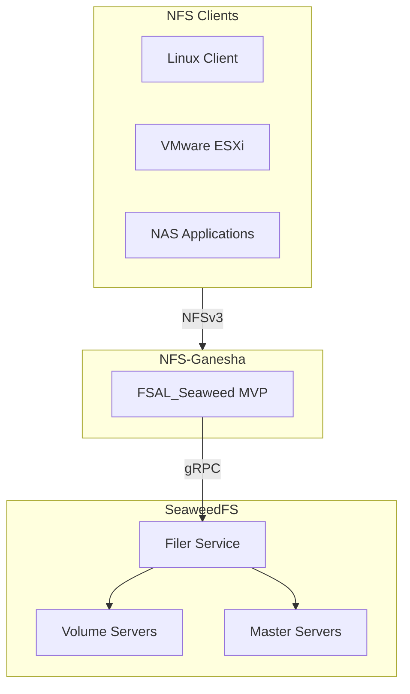

# FSAL_Seaweed MVP 实现设计

## 1. MVP 目标与范围

### 1.1 核心目标
- **实现 NFSv3 基础功能**，支持标准文件操作和目录操作
- **对接 SeaweedFS Filer**，提供可靠的文件存储后端
- **支持基本文件锁**，满足多客户端协作需求
- **提供 PoC 验证**，为后续 NFSv4 完整实现打下基础

### 1.2 功能范围

**✅ MVP 包含**：
- 基础 CRUD：创建、读取、写入、删除文件和目录
- 文件属性：getattr、setattr 操作
- 目录遍历：readdir 支持
- 简单文件级锁：基于 SeaweedFS Filer 内建锁机制
- 路径解析：filehandle 编码/解码

**❌ MVP 不包含**：
- NFSv4 stateid 和 open/close 语义
- byte-range 锁和复杂锁冲突处理
- delegation 和 lease 管理
- 分布式锁服务（etcd 集成）
- 高级缓存和性能优化

### 1.3 架构简化



------

## 2. Handle 管理设计

### 2.1 Filehandle 结构

基于文件路径生成稳定的 filehandle：

```c
struct seaweed_filehandle {
    uint32_t magic;           // 0x53454157 ('SEAW')
    uint16_t version;         // 版本号 (当前为 1)
    uint16_t flags;           // 标志位（保留）
    char path_hash[16];       // 完整路径的 MD5 哈希
    uint64_t create_time;     // 文件创建时间戳
    uint32_t path_len;        // 路径长度（用于验证）
} __attribute__((packed));
```

### 2.2 路径映射表

FSAL 维护内存映射表，支持路径解析：

```c
typedef struct {
    char path_hash[16];
    char full_path[PATH_MAX];
    time_t cache_time;
    bool is_valid;
} path_mapping_t;

// 全局映射表
static path_mapping_t *path_cache[HASH_TABLE_SIZE];
static pthread_rwlock_t path_cache_lock;
```

### 2.3 核心接口

```c
// 生成 filehandle
fsal_status_t create_handle_from_path(const char *path, 
                                      seaweed_filehandle_t *handle) {
    MD5(path, strlen(path), handle->path_hash);
    handle->magic = SEAWEED_MAGIC;
    handle->version = 1;
    handle->create_time = time(NULL);
    handle->path_len = strlen(path);
    
    // 加入映射表
    add_to_path_cache(handle->path_hash, path);
    return FSAL_NO_ERROR;
}

// 从 filehandle 解析路径
fsal_status_t resolve_path_from_handle(const seaweed_filehandle_t *handle,
                                       char *path_out, size_t path_size) {
    if (handle->magic != SEAWEED_MAGIC || handle->version != 1) {
        return FSAL_STALE;
    }
    
    return lookup_path_cache(handle->path_hash, path_out, path_size);
}
```

------

## 3. SeaweedFS Filer API 集成

### 3.1 连接管理

```c
typedef struct {
    grpc_channel *channel;
    seaweed_filer_stub *stub;
    char filer_endpoint[256];
    bool connected;
    pthread_mutex_t conn_lock;
} filer_connection_t;

static filer_connection_t filer_conn = {0};

fsal_status_t init_filer_connection(const char *endpoint) {
    pthread_mutex_lock(&filer_conn.conn_lock);
    
    strncpy(filer_conn.filer_endpoint, endpoint, sizeof(filer_conn.filer_endpoint)-1);
    filer_conn.channel = grpc_insecure_channel_create(endpoint, NULL);
    filer_conn.stub = seaweed_filer_stub_create(filer_conn.channel);
    filer_conn.connected = true;
    
    pthread_mutex_unlock(&filer_conn.conn_lock);
    return FSAL_NO_ERROR;
}
```

### 3.2 基本操作实现

#### 文件查找 (lookup)
```c
fsal_status_t seaweed_lookup(const char *parent_path, const char *name,
                             Entry *entry_out) {
    LookupDirectoryEntryRequest req = {0};
    LookupDirectoryEntryResponse resp = {0};
    
    req.directory = (char*)parent_path;
    req.name = (char*)name;
    
    grpc_status_code status = seaweed_filer_lookup_directory_entry(
        filer_conn.stub, &req, &resp);
    
    if (status == GRPC_STATUS_OK) {
        *entry_out = resp.entry;
        return FSAL_NO_ERROR;
    }
    
    return map_grpc_status_to_fsal(status);
}
```

#### 文件创建 (create)
```c
fsal_status_t seaweed_create_file(const char *parent_path, const char *name,
                                  uint32_t mode, Entry *entry_out) {
    CreateEntryRequest req = {0};
    CreateEntryResponse resp = {0};
    
    req.directory = (char*)parent_path;
    req.entry.name = (char*)name;
    req.entry.is_directory = false;
    req.entry.attributes.file_mode = mode;
    req.entry.attributes.uid = getuid();
    req.entry.attributes.gid = getgid();
    req.entry.attributes.mtime = time(NULL);
    req.entry.attributes.crtime = time(NULL);
    
    grpc_status_code status = seaweed_filer_create_entry(
        filer_conn.stub, &req, &resp);
    
    return (status == GRPC_STATUS_OK) ? FSAL_NO_ERROR : map_grpc_status_to_fsal(status);
}
```

#### 文件读取 (read)
```c
fsal_status_t seaweed_read_file(const char *file_path, uint64_t offset,
                                size_t count, void *buffer, size_t *bytes_read) {
    Entry entry;
    if (seaweed_lookup(dirname(file_path), basename(file_path), &entry) != FSAL_NO_ERROR) {
        return FSAL_STALE;
    }
    
    *bytes_read = 0;
    
    // 遍历文件的 chunks，找到对应 offset 的数据
    for (int i = 0; i < entry.chunks_count; i++) {
        FileChunk *chunk = &entry.chunks[i];
        
        if (chunk->offset <= offset && offset < chunk->offset + chunk->size) {
            // 从 Volume Server 读取数据
            size_t chunk_offset = offset - chunk->offset;
            size_t chunk_read_size = min(count, chunk->size - chunk_offset);
            
            if (read_from_volume_server(chunk, chunk_offset, chunk_read_size,
                                        (char*)buffer + *bytes_read) == 0) {
                *bytes_read += chunk_read_size;
                offset += chunk_read_size;
                count -= chunk_read_size;
                
                if (count == 0) break;
            }
        }
    }
    
    return FSAL_NO_ERROR;
}
```

#### 文件写入 (write)
```c
fsal_status_t seaweed_write_file(const char *file_path, uint64_t offset,
                                 size_t count, const void *buffer, size_t *bytes_written) {
    // 1. 分配存储卷
    AssignVolumeRequest assign_req = {0};
    AssignVolumeResponse assign_resp = {0};
    
    assign_req.count = 1;
    assign_req.replication = "000";  // 无复制，MVP 简化
    
    if (seaweed_filer_assign_volume(filer_conn.stub, &assign_req, &assign_resp) != GRPC_STATUS_OK) {
        return FSAL_SERVERFAULT;
    }
    
    // 2. 写入数据到 Volume Server
    if (write_to_volume_server(&assign_resp, buffer, count) != 0) {
        return FSAL_IO;
    }
    
    // 3. 更新文件 Entry，添加新的 chunk
    UpdateEntryRequest update_req = {0};
    update_req.directory = dirname(file_path);
    
    // 构造新的 FileChunk
    FileChunk new_chunk = {0};
    parse_file_id(assign_resp.file_id, &new_chunk.fid);
    new_chunk.offset = offset;
    new_chunk.size = count;
    new_chunk.modified_ts_ns = time(NULL) * 1000000000ULL;
    
    // TODO: 合并到现有 Entry 的 chunks 列表
    if (seaweed_filer_update_entry(filer_conn.stub, &update_req, NULL) == GRPC_STATUS_OK) {
        *bytes_written = count;
        return FSAL_NO_ERROR;
    }
    
    return FSAL_SERVERFAULT;
}
```

### 3.3 简单文件锁实现

利用 SeaweedFS Filer 的内建分布式锁：

```c
fsal_status_t seaweed_lock_file(const char *file_path, flock_type_t type,
                                char *lock_token_out, size_t token_size) {
    LockRequest req = {0};
    LockResponse resp = {0};
    
    req.name = (char*)file_path;
    req.seconds_to_lock = DEFAULT_LOCK_TIMEOUT; // 300秒
    req.owner = get_client_identifier();
    
    grpc_status_code status = seaweed_filer_distributed_lock(
        filer_conn.stub, &req, &resp);
    
    if (status == GRPC_STATUS_OK) {
        strncpy(lock_token_out, resp.renew_token, token_size-1);
        lock_token_out[token_size-1] = '\0';
        return FSAL_NO_ERROR;
    }
    
    return (resp.error && strlen(resp.error) > 0) ? FSAL_LOCK_BLOCKED : FSAL_SERVERFAULT;
}

fsal_status_t seaweed_unlock_file(const char *file_path, const char *lock_token) {
    UnlockRequest req = {0};
    UnlockResponse resp = {0};
    
    req.name = (char*)file_path;
    req.renew_token = (char*)lock_token;
    
    grpc_status_code status = seaweed_filer_distributed_unlock(
        filer_conn.stub, &req, &resp);
    
    return (status == GRPC_STATUS_OK) ? FSAL_NO_ERROR : FSAL_SERVERFAULT;
}
```

------

## 4. FSAL 接口实现

### 4.1 核心 FSAL 方法

```c
// fsal_lookup 实现
static fsal_status_t seaweed_fsal_lookup(struct fsal_obj_handle *parent,
                                         const char *path,
                                         struct fsal_obj_handle **handle,
                                         struct fsal_attrlist *attrs_out) {
    char parent_path[PATH_MAX];
    Entry entry;
    
    // 从 parent handle 解析路径
    if (resolve_path_from_handle(&parent->handle, parent_path, sizeof(parent_path)) != FSAL_NO_ERROR) {
        return fsalstat(ERR_FSAL_STALE, 0);
    }
    
    // 调用 SeaweedFS lookup
    if (seaweed_lookup(parent_path, path, &entry) != FSAL_NO_ERROR) {
        return fsalstat(ERR_FSAL_NOENT, 0);
    }
    
    // 创建新的 FSAL handle
    struct seaweed_fsal_obj_handle *new_handle = create_seaweed_handle(&entry, parent_path, path);
    *handle = &new_handle->obj_handle;
    
    // 转换属性
    if (attrs_out) {
        convert_entry_to_attrs(&entry, attrs_out);
    }
    
    return fsalstat(ERR_FSAL_NO_ERROR, 0);
}

// fsal_create 实现  
static fsal_status_t seaweed_fsal_create(struct fsal_obj_handle *dir_hdl,
                                         const char *name,
                                         struct fsal_attrlist *attrib,
                                         struct fsal_obj_handle **handle,
                                         struct fsal_attrlist *attrs_out) {
    char parent_path[PATH_MAX];
    Entry entry;
    
    if (resolve_path_from_handle(&dir_hdl->handle, parent_path, sizeof(parent_path)) != FSAL_NO_ERROR) {
        return fsalstat(ERR_FSAL_STALE, 0);
    }
    
    if (seaweed_create_file(parent_path, name, attrib->mode, &entry) != FSAL_NO_ERROR) {
        return fsalstat(ERR_FSAL_EXIST, 0); // 简化错误处理
    }
    
    struct seaweed_fsal_obj_handle *new_handle = create_seaweed_handle(&entry, parent_path, name);
    *handle = &new_handle->obj_handle;
    
    if (attrs_out) {
        convert_entry_to_attrs(&entry, attrs_out);
    }
    
    return fsalstat(ERR_FSAL_NO_ERROR, 0);
}

// fsal_read 实现
static fsal_status_t seaweed_fsal_read(struct fsal_obj_handle *obj_hdl,
                                       uint64_t offset,
                                       size_t buffer_size,
                                       void *buffer,
                                       size_t *read_amount,
                                       bool *end_of_file) {
    char file_path[PATH_MAX];
    
    if (resolve_path_from_handle(&obj_hdl->handle, file_path, sizeof(file_path)) != FSAL_NO_ERROR) {
        return fsalstat(ERR_FSAL_STALE, 0);
    }
    
    if (seaweed_read_file(file_path, offset, buffer_size, buffer, read_amount) != FSAL_NO_ERROR) {
        return fsalstat(ERR_FSAL_IO, 0);
    }
    
    *end_of_file = (*read_amount < buffer_size);
    return fsalstat(ERR_FSAL_NO_ERROR, 0);
}
```

### 4.2 错误码映射

```c
fsal_status_t map_grpc_status_to_fsal(grpc_status_code grpc_status) {
    switch (grpc_status) {
    case GRPC_STATUS_OK:
        return FSAL_NO_ERROR;
    case GRPC_STATUS_NOT_FOUND:
        return FSAL_NOENT;
    case GRPC_STATUS_ALREADY_EXISTS:
        return FSAL_EXIST;
    case GRPC_STATUS_PERMISSION_DENIED:
        return FSAL_ACCESS;
    case GRPC_STATUS_RESOURCE_EXHAUSTED:
        return FSAL_NOSPC;
    case GRPC_STATUS_INVALID_ARGUMENT:
        return FSAL_INVAL;
    case GRPC_STATUS_UNAVAILABLE:
        return FSAL_DELAY;
    default:
        return FSAL_SERVERFAULT;
    }
}
```

------

## 5. 配置和初始化

### 5.1 配置文件格式

```conf
FSAL {
    Name = SEAWEEDFS;
    filer_endpoint = "localhost:18888";
    connection_timeout = 30;
    default_lock_timeout = 300;
    path_cache_size = 10000;
    path_cache_ttl = 3600;
}

EXPORT {
    Export_ID = 1;
    Path = /;
    Pseudo = /seaweedfs;
    Access_Type = RW;
    FSAL {
        Name = SEAWEEDFS;
    }
}
```

### 5.2 模块初始化

```c
fsal_status_t init_seaweed_fsal(struct fsal_module *fsal_hdl,
                                config_file_t config_struct,
                                struct config_error_type *err_type) {
    struct seaweed_fsal_module *seaweed_module = 
        container_of(fsal_hdl, struct seaweed_fsal_module, fsal);
        
    // 解析配置
    const char *filer_endpoint = config_get_string(config_struct, "filer_endpoint", "localhost:18888");
    
    // 初始化连接
    if (init_filer_connection(filer_endpoint) != FSAL_NO_ERROR) {
        return FSAL_SERVERFAULT;
    }
    
    // 初始化路径缓存
    if (init_path_cache() != FSAL_NO_ERROR) {
        return FSAL_NOMEM;
    }
    
    gsh_log(COMPONENT_FSAL, "FSAL_SEAWEEDFS MVP initialized, endpoint: %s", filer_endpoint);
    return FSAL_NO_ERROR;
}
```

------

## 6. 测试计划

### 6.1 单元测试

```c
void test_handle_encoding_decoding() {
    const char *test_path = "/test/file.txt";
    seaweed_filehandle_t handle;
    
    // 测试编码
    assert(create_handle_from_path(test_path, &handle) == FSAL_NO_ERROR);
    assert(handle.magic == SEAWEED_MAGIC);
    
    // 测试解码
    char decoded_path[PATH_MAX];
    assert(resolve_path_from_handle(&handle, decoded_path, sizeof(decoded_path)) == FSAL_NO_ERROR);
    assert(strcmp(decoded_path, test_path) == 0);
}

void test_basic_file_operations() {
    const char *test_file = "/test/mvp_test.txt";
    Entry entry;
    
    // 创建文件
    assert(seaweed_create_file("/test", "mvp_test.txt", 0644, &entry) == FSAL_NO_ERROR);
    
    // 查找文件  
    assert(seaweed_lookup("/test", "mvp_test.txt", &entry) == FSAL_NO_ERROR);
    
    // 写入数据
    const char *test_data = "Hello SeaweedFS MVP";
    size_t written;
    assert(seaweed_write_file(test_file, 0, strlen(test_data), test_data, &written) == FSAL_NO_ERROR);
    assert(written == strlen(test_data));
    
    // 读取数据
    char buffer[1024];
    size_t read_bytes;
    assert(seaweed_read_file(test_file, 0, sizeof(buffer), buffer, &read_bytes) == FSAL_NO_ERROR);
    assert(read_bytes == strlen(test_data));
    assert(memcmp(buffer, test_data, read_bytes) == 0);
}
```

### 6.2 集成测试

```bash
#!/bin/bash

# 启动 SeaweedFS 集群（测试模式）
weed server -dir=/tmp/seaweedfs-test -filer &
sleep 5

# 启动 NFS-Ganesha with FSAL_SeaweedFS
ganesha.nfsd -f ganesha-seaweed-mvp.conf &
sleep 3

# 挂载 NFS
mkdir -p /mnt/seaweed-nfs
mount -t nfs -o vers=3 localhost:/seaweedfs /mnt/seaweed-nfs

# 基础功能测试
echo "Testing basic operations..."

# 文件操作
echo "Hello World" > /mnt/seaweed-nfs/test.txt
cat /mnt/seaweed-nfs/test.txt
ls -la /mnt/seaweed-nfs/

# 目录操作  
mkdir /mnt/seaweed-nfs/testdir
ls -la /mnt/seaweed-nfs/testdir/
rmdir /mnt/seaweed-nfs/testdir

# 文件锁测试（基础）
flock /mnt/seaweed-nfs/test.txt -c "sleep 5; echo locked"

echo "MVP tests completed"
```

### 6.3 性能基准测试

```bash
# I/O 性能测试
dd if=/dev/zero of=/mnt/seaweed-nfs/testfile bs=1M count=100

# 小文件性能测试
time for i in {1..1000}; do
    echo "test$i" > /mnt/seaweed-nfs/small_$i.txt
done

# 并发访问测试
for i in {1..10}; do
    (dd if=/dev/zero of=/mnt/seaweed-nfs/concurrent_$i.dat bs=1M count=10) &
done
wait
```

------

## 7. 已知限制和后续规划

### 7.1 MVP 限制

1. **只支持 NFSv3**：无 stateid、open/close 语义
2. **文件级锁**：无 byte-range 锁支持
3. **无高级缓存**：简单的路径缓存，无一致性保证
4. **错误处理简化**：重试机制和故障恢复较基础
5. **单 Filer 连接**：无连接池和负载均衡

### 7.2 后续演进路径

**阶段 2：性能优化**
- 连接池管理
- 并发 I/O 优化
- 智能缓存策略

**阶段 3：NFSv4.0 支持**
- stateid 管理
- open/close 语义
- share reservation

**阶段 4：完整分布式锁**
- etcd 集成
- byte-range 锁
- grace period 处理

**阶段 5：企业级特性**
- 高可用性 (CTDB)
- 监控和可观测性
- 安全增强 (Kerberos)

------

## 8. 构建和部署

### 8.1 编译依赖

```makefile
# SeaweedFS gRPC 客户端库
SEAWEED_LIBS = -lseaweedfs_client -lgrpc++ -lprotobuf

# 编译 FSAL_SeaweedFS MVP
fsal_seaweedfs_mvp.so: fsal_seaweedfs_mvp.c
    gcc -shared -fPIC -I$(GANESHA_INCLUDE) \
        -o fsal_seaweedfs_mvp.so fsal_seaweedfs_mvp.c \
        $(SEAWEED_LIBS)
```

### 8.2 部署清单

1. ✅ SeaweedFS 集群搭建和测试
2. ✅ NFS-Ganesha 编译环境准备
3. ✅ FSAL_SeaweedFS MVP 模块编译
4. ✅ 配置文件调试
5. ✅ 基础功能验证
6. ✅ 性能基准测试
7. ✅ 多客户端兼容性测试

这个 MVP 设计专注于核心功能实现，为快速验证 SeaweedFS + NFS-Ganesha 集成的可行性提供基础。通过简化架构和功能范围，可以在较短时间内实现一个可工作的原型。